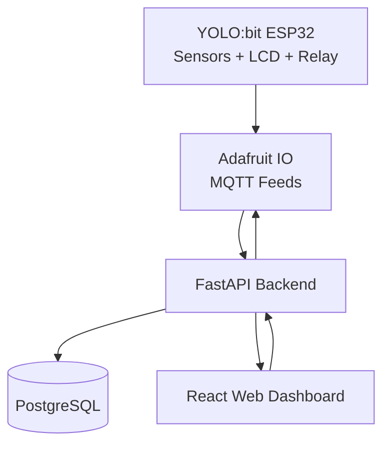
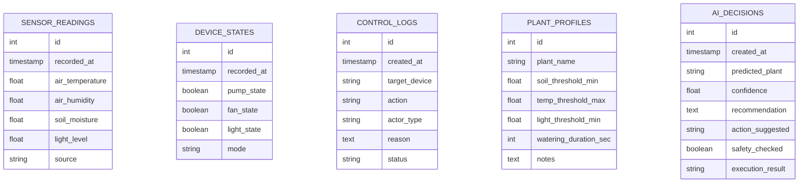

Dĩ nhiên. Dưới đây là một bản **Software Engineering Document – Week 1** đã được mình **chuẩn hóa theo hướng MVP, dễ code khung, dễ phân công, dễ báo cáo**, bám sát định hướng bạn đã chốt: **YOLO:bit ESP32 + Adafruit IO + FastAPI + PostgreSQL + React**. Kiến trúc được giữ theo tinh thần phân lớp thiết bị → cloud/backend → frontend, nhưng rút gọn để phù hợp 5 tuần và giảm rủi ro tích hợp [Source](https://www.genspark.ai/api/files/s/HL0PvxQ5)

---

# Software Engineering Document – Week 1  
## Dự án: Smart Garden Web-based IoT with AI-assisted Decision Support  
**Phiên bản:** v0.1  
**Giai đoạn:** Week 1 – Foundation & Project Skeleton  
**Mục tiêu:** dựng xương sống kỹ thuật để nhóm có thể bắt đầu code ngay từ tuần 1

---

## 1. Mục tiêu tài liệu

Tài liệu này mô tả phạm vi kỹ thuật của tuần 1 cho dự án **Smart Garden**, bao gồm định nghĩa MVP, kiến trúc hệ thống, stack công nghệ, cấu trúc repository, thiết kế dữ liệu ban đầu, phân rã module, API khởi tạo, quy ước làm việc nhóm và kế hoạch thực thi trong 7 ngày đầu.

Mục tiêu của tuần 1 không phải là hoàn thiện toàn bộ tính năng, mà là **khóa kiến trúc**, **dựng khung phần mềm**, **xác nhận đường đi dữ liệu**, và tạo một nền tảng đủ ổn để các tuần sau chỉ tập trung vào tích hợp và hoàn thiện.

---

## 2. Tóm tắt MVP đã chốt

Dự án sẽ xây dựng một hệ thống **vườn thông minh dạng web**, có thiết bị IoT thật, dashboard web đẹp, lịch sử dữ liệu đầy đủ, và AI đóng vai trò hỗ trợ quyết định với ràng buộc an toàn.

### 2.1. 5 năng lực lõi của MVP
1. Đọc dữ liệu cảm biến thật từ thiết bị.
2. Hiển thị dữ liệu trên LCD và web dashboard.
3. Điều khiển thật bơm/quạt/đèn từ web.
4. Tự động điều khiển theo ngưỡng và lưu lịch sử đầy đủ.
5. Có AI làm điểm nhấn: nhận diện/chọn loại cây, sinh profile chăm sóc, gợi ý hoặc tự kích hoạt trong giới hạn an toàn.

### 2.2. Phạm vi của Week 1
Trong tuần 1, nhóm **chưa cần hoàn thành end-to-end đầy đủ**, mà phải hoàn thành các nền tảng sau:
- chốt stack chính thức;
- dựng repo và coding convention;
- dựng backend skeleton chạy local;
- dựng frontend skeleton với các page chính;
- xác định database schema v0;
- xác nhận firmware đọc được sensor và hiển thị LCD;
- chuẩn bị sẵn contract để tuần 2 nối data thật xuyên hệ thống.

---

## 3. Phạm vi tuần 1

## 3.1. In-scope
Week 1 bao gồm các đầu việc nền tảng:
- xác nhận công nghệ chính thức cho từng lớp hệ thống;
- dựng cấu trúc thư mục cho frontend, backend, firmware;
- khởi tạo database schema mức cơ bản;
- dựng layout dashboard/control/history/AI page;
- tạo REST API skeleton;
- xây dựng tài liệu quy ước code, branch, commit, môi trường;
- kiểm tra phần cứng: cảm biến, relay, LCD, ESP32 Wi-Fi.

## 3.2. Out-of-scope
Các nội dung dưới đây **không phải trọng tâm của tuần 1**:
- AI model huấn luyện thật;
- deploy production hoàn chỉnh;
- auth hoàn chỉnh;
- xử lý nhiều chậu/multi-zone;
- tối ưu UI chi tiết;
- auto mode hoàn chỉnh;
- control thật xuyên từ web đến relay.

---

## 4. Kiến trúc hệ thống tuần 1

Kiến trúc mục tiêu của dự án được rút gọn theo 4 lớp chính: **thiết bị IoT**, **MQTT trung gian**, **backend điều phối**, và **frontend dashboard**. Cách tổ chức này giữ được tinh thần kiến trúc phân lớp của sơ đồ tham chiếu nhưng loại bỏ gateway vật lý riêng để phù hợp thời gian 5 tuần [Source](https://www.genspark.ai/api/files/s/HL0PvxQ5)

### 4.1. Kiến trúc mức cao



### 4.2. Vai trò từng lớp

**Lớp thiết bị** chịu trách nhiệm đọc cảm biến, hiển thị LCD, nhận lệnh relay và giao tiếp qua Wi-Fi.

**Lớp Adafruit IO** đóng vai trò trung gian MQTT để giảm độ phức tạp tích hợp trực tiếp, giúp publish sensor data và subscribe control command nhanh hơn.

**Lớp backend FastAPI** là trung tâm logic hệ thống: chuẩn hóa dữ liệu, lưu lịch sử, cung cấp REST API, triển khai Auto mode và AI mode sau này.

**Lớp frontend React** là nơi người dùng quan sát realtime dashboard, gửi lệnh điều khiển, xem history, cấu hình mode và tương tác với AI.

---

## 5. Quyết định công nghệ chính thức

### 5.1. Stack chính

| Lớp | Công nghệ | Lý do chọn |
|---|---|---|
| Firmware | YOLO:bit ESP32 | Có Wi-Fi sẵn, phù hợp demo IoT |
| Sensor/Actuator | Soil moisture, temp/humidity, light, LCD, relay | Đủ để tạo use case rõ |
| Messaging | Adafruit IO MQTT | Nhanh, đơn giản, phù hợp sinh viên |
| Backend | FastAPI | Gọn, nhanh, hợp Python AI |
| Database | PostgreSQL | Tốt cho history/log/schema rõ ràng |
| Frontend | React + Vite | Nhanh, phổ biến, dễ code khung |
| UI | MUI | Ra giao diện chuyên nghiệp nhanh |
| Chart | Recharts | Dễ dùng cho dashboard |
| AI | Python + scikit-learn | Phù hợp MVP |
| Hosting FE | Firebase Hosting | Nhanh cho demo |
| Hosting BE | Render hoặc Railway | Đơn giản |
| Postgres cloud | Neon hoặc Supabase | Khởi tạo nhanh |

### 5.2. Quyết định loại bỏ khỏi MVP
- Không dùng Spring Boot.
- Không làm mobile app riêng.
- Không dùng Raspberry Pi gateway.
- Không làm RL thực chiến trong MVP.

---

## 6. Functional Decomposition – Phân rã module

### 6.1. Firmware Module
Phụ trách đọc sensor, hiển thị LCD, gửi dữ liệu lên MQTT, nhận control command và kích relay.

### 6.2. Backend Module
Phụ trách:
- ingest dữ liệu sensor;
- lưu DB;
- trả latest sensor data;
- trả history;
- nhận manual command;
- ghi action log;
- chuẩn bị Auto/AI decision engine.

### 6.3. Frontend Module
Phụ trách:
- dashboard realtime;
- control panel;
- lịch sử dữ liệu;
- AI page;
- điều hướng và khung UI.

### 6.4. AI Module
Trong tuần 1, AI module chưa train model, nhưng phải chuẩn bị:
- thư mục service riêng;
- interface cho plant profile;
- API placeholder cho upload image / classify plant / suggestion.

---

## 7. Use cases chính của hệ thống

### UC-01: Xem trạng thái hệ thống
Người dùng truy cập dashboard để xem nhiệt độ, độ ẩm không khí, độ ẩm đất, ánh sáng, trạng thái bơm/quạt/đèn.

### UC-02: Điều khiển thủ công
Người dùng bật/tắt bơm, quạt, đèn từ web. Hệ thống ghi nhận lệnh, lưu log, và gửi lệnh xuống thiết bị.

### UC-03: Xem lịch sử
Người dùng xem lịch sử sensor và thiết bị theo thời gian.

### UC-04: Chuyển mode
Người dùng chuyển giữa Manual / Auto / AI mode.

### UC-05: AI hỗ trợ
Người dùng upload ảnh cây hoặc chọn cây từ danh sách để hệ thống sinh profile chăm sóc.

---

## 8. Non-functional Requirements

### 8.1. Tính rõ ràng kiến trúc
Code phải tách lớp rõ: firmware, backend, frontend, docs.

### 8.2. Tính mở rộng
Thiết kế phải hỗ trợ thêm AI logic ở tuần 4 mà không cần refactor lớn.

### 8.3. Tính an toàn
Mọi quyết định điều khiển sau này đều phải đi qua lớp safety rule.

### 8.4. Tính quan sát được
Mọi sensor reading, command, decision phải có khả năng log lại.

### 8.5. Tính demo-friendly
UI phải có skeleton từ tuần 1 để không bị dồn làm đẹp quá muộn.

---

## 9. Thiết kế dữ liệu ban đầu – Database Schema v0

Tuần 1 nên khóa schema ở mức tối thiểu nhưng đủ mở rộng.

### 9.1. Danh sách bảng

#### `sensor_readings`
Lưu bản ghi cảm biến theo thời gian.

| Trường | Kiểu | Ghi chú |
|---|---|---|
| id | UUID / SERIAL | PK |
| recorded_at | TIMESTAMP | thời điểm ghi |
| air_temperature | FLOAT | nhiệt độ |
| air_humidity | FLOAT | độ ẩm không khí |
| soil_moisture | FLOAT | độ ẩm đất |
| light_level | FLOAT | ánh sáng |
| source | VARCHAR | device / mock |

#### `device_states`
Lưu trạng thái hiện tại hoặc snapshot của actuator.

| Trường | Kiểu |
|---|---|
| id | UUID / SERIAL |
| recorded_at | TIMESTAMP |
| pump_state | BOOLEAN |
| fan_state | BOOLEAN |
| light_state | BOOLEAN |
| mode | VARCHAR |

#### `control_logs`
Lưu lịch sử thao tác điều khiển.

| Trường | Kiểu | Ghi chú |
|---|---|---|
| id | UUID / SERIAL | PK |
| created_at | TIMESTAMP | |
| target_device | VARCHAR | pump/fan/light |
| action | VARCHAR | on/off |
| actor_type | VARCHAR | user/system/ai |
| reason | TEXT | manual, threshold, ai recommendation |
| status | VARCHAR | success/failed/pending |

#### `plant_profiles`
Lưu profile cây.

| Trường | Kiểu |
|---|---|
| id | UUID / SERIAL |
| plant_name | VARCHAR |
| soil_threshold_min | FLOAT |
| temp_threshold_max | FLOAT |
| light_threshold_min | FLOAT |
| watering_duration_sec | INT |
| notes | TEXT |

#### `ai_decisions`
Lưu quyết định/gợi ý của AI.

| Trường | Kiểu |
|---|---|
| id | UUID / SERIAL |
| created_at | TIMESTAMP |
| predicted_plant | VARCHAR |
| confidence | FLOAT |
| recommendation | TEXT |
| action_suggested | VARCHAR |
| safety_checked | BOOLEAN |
| execution_result | VARCHAR |

### 9.2. ERD rút gọn



---

## 10. API Design v0 – Contract để code song song

Week 1 chưa cần full implementation, nhưng phải chốt contract để backend và frontend làm độc lập.

### 10.1. Sensor APIs

**GET `/api/v1/sensors/latest`**  
Trả dữ liệu cảm biến mới nhất.

Ví dụ response:
```json
{
  "recorded_at": "2026-03-25T10:30:00Z",
  "air_temperature": 30.2,
  "air_humidity": 68.5,
  "soil_moisture": 27.1,
  "light_level": 412.0
}
```

**GET `/api/v1/sensors/history`**  
Query params:
- `from`
- `to`
- `limit`

### 10.2. Device APIs

**GET `/api/v1/devices/state`**  
Trả trạng thái hiện tại của pump/fan/light/mode.

**POST `/api/v1/devices/control`**  
Body:
```json
{
  "target_device": "pump",
  "action": "on",
  "actor_type": "user",
  "reason": "manual control from dashboard"
}
```

### 10.3. Mode APIs

**POST `/api/v1/system/mode`**
```json
{
  "mode": "manual"
}
```

### 10.4. Logs APIs

**GET `/api/v1/logs/control`**  
Trả action logs.

### 10.5. AI APIs placeholder

**POST `/api/v1/ai/classify-plant`**  
Tuần 1 chỉ cần mock response.

**GET `/api/v1/ai/profile/{plant_name}`**

---

## 11. Frontend Information Architecture

Frontend trong tuần 1 phải có đủ 4 page để “nhìn thấy tương lai hệ thống”, dù dữ liệu có thể là mock.

### 11.1. Dashboard Page
Hiển thị:
- card nhiệt độ;
- card độ ẩm không khí;
- card độ ẩm đất;
- card ánh sáng;
- trạng thái pump/fan/light;
- chart placeholder;
- badge mode.

### 11.2. Control Page
Hiển thị:
- 3 toggle điều khiển pump/fan/light;
- switch mode Manual / Auto / AI;
- recent command log.

### 11.3. History Page
Hiển thị:
- bảng sensor history;
- biểu đồ theo thời gian;
- log thao tác.

### 11.4. AI Page
Hiển thị:
- upload image khu vực;
- plant selector fallback;
- card plant profile;
- AI recommendation card;
- explanation panel.

---

## 12. Cấu trúc repository đề xuất

Đây là khung repo phù hợp để cả nhóm code song song ngay từ tuần 1.

```bash
smart-garden/
├── README.md
├── docs/
│   ├── software-engineering-week1.md
│   ├── architecture.md
│   ├── api-contract.md
│   └── db-schema.md
├── firmware/
│   ├── src/
│   ├── include/
│   ├── lib/
│   └── platformio.ini
├── backend/
│   ├── app/
│   │   ├── main.py
│   │   ├── core/
│   │   │   ├── config.py
│   │   │   └── database.py
│   │   ├── models/
│   │   │   ├── sensor.py
│   │   │   ├── device.py
│   │   │   ├── log.py
│   │   │   └── plant.py
│   │   ├── schemas/
│   │   ├── routers/
│   │   │   ├── sensors.py
│   │   │   ├── devices.py
│   │   │   ├── logs.py
│   │   │   └── ai.py
│   │   ├── services/
│   │   │   ├── adafruit_service.py
│   │   │   ├── control_service.py
│   │   │   └── ai_service.py
│   │   └── utils/
│   ├── tests/
│   ├── requirements.txt
│   └── .env.example
├── frontend/
│   ├── src/
│   │   ├── api/
│   │   ├── components/
│   │   ├── layouts/
│   │   ├── pages/
│   │   │   ├── DashboardPage.tsx
│   │   │   ├── ControlPage.tsx
│   │   │   ├── HistoryPage.tsx
│   │   │   └── AIPage.tsx
│   │   ├── routes/
│   │   ├── hooks/
│   │   ├── types/
│   │   ├── mock/
│   │   └── App.tsx
│   ├── package.json
│   └── vite.config.ts
└── .gitignore
```

---

## 13. Coding Convention & Team Workflow

### 13.1. Branch strategy
- `main`: branch ổn định
- `develop`: branch tích hợp
- `feature/<name>`: branch cho từng tính năng

Ví dụ:
- `feature/frontend-dashboard`
- `feature/backend-sensor-api`
- `feature/firmware-sensor-read`

### 13.2. Commit convention
Dùng format:
- `feat: add dashboard skeleton`
- `fix: correct sensor parsing`
- `docs: update week1 architecture`
- `refactor: separate device control service`

### 13.3. Naming convention
- Backend file/function theo `snake_case`
- Frontend component theo `PascalCase`
- API path dùng `kebab-case` hoặc resource-based REST
- DB table dùng `snake_case`

### 13.4. Pull request rule
Mỗi PR nên:
- scope nhỏ;
- có mô tả rõ;
- có screenshot nếu là frontend;
- có sample request/response nếu là backend.

---

## 14. Definition of Done cho Week 1

Một tuần 1 được xem là hoàn thành khi đáp ứng đồng thời các điều kiện sau:

### 14.1. Phần cứng
- ESP32 đọc được ít nhất 1 bộ sensor thật.
- LCD hiển thị được tối thiểu 1–2 giá trị.
- Relay được xác nhận wiring ổn.

### 14.2. Backend
- FastAPI chạy local thành công.
- Có route health check.
- Có ít nhất các API mock hoặc cơ bản cho latest sensor và device state.
- PostgreSQL kết nối thành công.
- Schema v0 được tạo.

### 14.3. Frontend
- React app chạy local.
- Có navbar/sidebar.
- Có đủ 4 page khung.
- Dùng mock data hiển thị được card và bảng cơ bản.

### 14.4. Tài liệu
- Có architecture overview.
- Có DB schema.
- Có API contract.
- Có phân công thành viên.

---

## 15. WBS chi tiết cho tuần 1

## Day 1 – Kickoff & khóa kiến trúc
- họp nhóm chốt MVP;
- chốt stack;
- tạo repo GitHub;
- chia thư mục `firmware`, `backend`, `frontend`, `docs`;
- viết README khởi tạo.

## Day 2 – Backend & DB skeleton
- init FastAPI project;
- init PostgreSQL;
- tạo bảng `sensor_readings`, `device_states`, `control_logs`;
- viết route:
  - `/health`
  - `/api/v1/sensors/latest`
  - `/api/v1/devices/state`

## Day 3 – Frontend skeleton
- init React + Vite;
- cài MUI, React Router, Recharts;
- tạo layout chính;
- tạo 4 page khung;
- dùng mock JSON hiển thị dashboard cơ bản.

## Day 4 – Firmware baseline
- đọc sensor;
- kiểm tra giá trị ổn định;
- hiển thị LCD;
- chuẩn bị config Wi-Fi và Adafruit IO feed naming.

## Day 5 – API contract & integration mock
- frontend gọi được backend local;
- backend trả mock latest sensor;
- frontend render dữ liệu từ API thật thay vì hard-code.

## Day 6 – Documentation & review
- chốt sơ đồ kiến trúc;
- chốt schema;
- chốt convention;
- cập nhật software engineering document;
- review gaps.

## Day 7 – Demo nội bộ tuần 1
- demo frontend khung;
- demo backend chạy;
- demo sensor đọc thật;
- kiểm tra tiến độ từng thành viên;
- khóa backlog tuần 2.

---

## 16. Phân công 4 thành viên trong tuần 1

### Member 1 – Embedded / IoT
- setup sensor, LCD, relay;
- đọc giá trị sensor;
- chuẩn bị publish MQTT.

### Member 2 – Backend / Database
- init FastAPI;
- kết nối PostgreSQL;
- dựng schema v0;
- tạo API basic.

### Member 3 – Frontend
- init React;
- dựng layout;
- dựng Dashboard / Control / History / AI page skeleton.

### Member 4 – AI + Integration + Docs
- dựng AI module placeholder;
- chuẩn bị plant profile format;
- viết tài liệu architecture / DB / API;
- hỗ trợ backend/frontend integration khi cần.

---

## 17. Rủi ro tuần 1 và cách giảm thiểu

### Rủi ro 1: Chưa khóa stack, team code lệch hướng
**Giảm thiểu:** chốt stack trong Day 1, không đổi công nghệ sau khi kickoff.

### Rủi ro 2: Frontend làm muộn
**Giảm thiểu:** Day 3 phải có UI skeleton chạy được.

### Rủi ro 3: DB không được thiết kế sớm
**Giảm thiểu:** schema phải chốt từ Day 2.

### Rủi ro 4: Firmware chậm vì phần cứng lỗi
**Giảm thiểu:** test từng sensor độc lập, có mock data backup cho frontend/backend.

### Rủi ro 5: Tích hợp sớm bị block
**Giảm thiểu:** dùng API mock contract để frontend không phải chờ backend hoàn chỉnh.

---

## 18. Backlog chuyển sang Week 2

Nếu Week 1 hoàn thành đúng kế hoạch, Week 2 sẽ tập trung vào:
- publish sensor thật lên Adafruit IO;
- backend ingest dữ liệu thật;
- lưu DB theo thời gian;
- frontend hiển thị latest sensor thật;
- hoàn thiện history cơ bản.

---

## 19. Appendix A – Environment variables đề xuất

### Backend `.env.example`
```env
APP_NAME=smart-garden-api
APP_ENV=development
API_PREFIX=/api/v1

POSTGRES_HOST=localhost
POSTGRES_PORT=5432
POSTGRES_DB=smart_garden
POSTGRES_USER=postgres
POSTGRES_PASSWORD=postgres

ADAFRUIT_IO_USERNAME=your_username
ADAFRUIT_IO_KEY=your_key

CORS_ORIGINS=http://localhost:5173
```

### Frontend `.env`
```env
VITE_API_BASE_URL=http://localhost:8000/api/v1
```

---

## 20. Appendix B – Prompt vibe coding cho từng phần

Nếu nhóm muốn code nhanh bằng AI assistant, có thể dùng prompt ngắn gọn nhưng đúng scope.

### Prompt cho backend
> Tạo cho tôi backend FastAPI cho dự án Smart Garden. Yêu cầu có cấu trúc thư mục chuẩn, PostgreSQL với SQLAlchemy, model cho sensor_readings, device_states, control_logs, API `/health`, `/api/v1/sensors/latest`, `/api/v1/devices/state`, và seed mock data để frontend test.

### Prompt cho frontend
> Tạo cho tôi frontend React + Vite + TypeScript + MUI cho Smart Garden Dashboard. Yêu cầu có sidebar, topbar, 4 page gồm Dashboard, Control, History, AI, responsive layout, card hiển thị sensor, bảng logs, chart placeholder bằng Recharts.

### Prompt cho DB
> Thiết kế PostgreSQL schema cho Smart Garden với bảng sensor_readings, device_states, control_logs, plant_profiles, ai_decisions. Ưu tiên khả năng lưu lịch sử và mở rộng cho Auto mode và AI mode.

### Prompt cho firmware
> Viết skeleton firmware cho ESP32 để đọc soil moisture, DHT temperature/humidity, light sensor, hiển thị LCD, chuẩn bị publish dữ liệu JSON qua MQTT tới Adafruit IO và subscribe control command cho relay.

---

# Bản chốt ngắn để nhóm bắt đầu ngay

Nếu cần một câu chốt để cả nhóm thống nhất:

**Tuần 1 phải hoàn thành: stack chính thức, repo chuẩn, frontend 4 page skeleton, backend FastAPI chạy local, PostgreSQL schema v0, sensor đọc được trên ESP32 và hiển thị LCD.**

---

Nếu bạn muốn, ở bước tiếp theo mình có thể làm tiếp ngay **1 trong 3 thứ** sau cho bạn:

**1.** chuyển bản trên thành **template báo cáo Word/Google Docs formal hơn**  
**2.** viết tiếp **WBS tuần 1 theo từng ngày cho 4 thành viên dạng checklist**  
**3.** dựng luôn **khung repo code thực tế** gồm:
- tree frontend
- tree backend
- SQL schema
- FastAPI starter
- React page starter

Nếu muốn nhanh để “vibe coding”, mình khuyên bước kế tiếp là:  
**mình viết luôn cho bạn bộ “starter kit tuần 1” gồm repo structure + SQL schema + API contract + task checklist.**