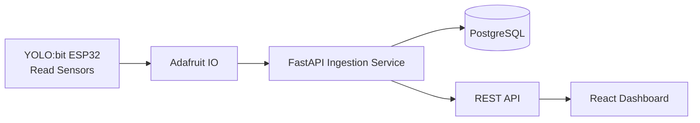

Được, mình sẽ **tiếp tục theo đúng format báo cáo + hướng dẫn triển khai cụ thể**, nhưng lần này cho **Tuần 2**.

Mục tiêu của tuần 2 là: **không còn dừng ở skeleton nữa, mà phải làm cho dữ liệu cảm biến đi xuyên hệ thống**:  
**ESP32/YOLO:bit → Adafruit IO → FastAPI → PostgreSQL → React Dashboard**.  
Kiến trúc này vẫn bám theo tinh thần phân lớp thiết bị → cloud/backend → frontend mà nhóm đã chốt từ đầu [Source](https://www.genspark.ai/api/files/s/HL0PvxQ5)

Bạn có thể copy nguyên khối dưới đây làm **báo cáo tuần 2** hoặc dùng như **kế hoạch triển khai chi tiết** cho nhóm.

---

# TEMPLATE BÁO CÁO TUẦN 2  
## Dự án: Hệ thống Vườn Thông Minh Web-based IoT tích hợp AI hỗ trợ quyết định

---

## 1. Giới thiệu tuần 2

Sau khi hoàn thành tuần 1 với các đầu việc nền tảng như chốt stack công nghệ, dựng khung frontend, backend skeleton, thiết kế database schema ban đầu và kiểm tra khả năng đọc cảm biến ở mức cơ bản, tuần 2 được xác định là giai đoạn **tích hợp dữ liệu thật xuyên hệ thống**.

Trọng tâm của tuần này không còn là “dựng khung” nữa, mà là làm cho dữ liệu cảm biến được truyền từ thiết bị thật lên nền tảng trung gian, sau đó đi vào backend để lưu cơ sở dữ liệu và hiển thị trên dashboard web. Đây là bước quan trọng vì nó đánh dấu việc hệ thống bắt đầu hoạt động như một sản phẩm hoàn chỉnh thay vì chỉ là các thành phần rời rạc.

Mục tiêu kỹ thuật của tuần 2 là xác lập được luồng dữ liệu thực tế theo mô hình thiết bị IoT → Adafruit IO → FastAPI → PostgreSQL → React Dashboard, phù hợp với kiến trúc phân lớp đã được nhóm lựa chọn [Source](https://www.genspark.ai/api/files/s/HL0PvxQ5)

---

## 2. Mục tiêu tuần 2

Tuần 2 hướng tới 4 mục tiêu chính.

Thứ nhất, thiết bị cần gửi được dữ liệu cảm biến thật lên Adafruit IO thông qua MQTT hoặc cơ chế publish phù hợp.

Thứ hai, backend FastAPI phải nhận được dữ liệu đó, chuẩn hóa dữ liệu đầu vào và lưu vào PostgreSQL theo schema đã thiết kế ở tuần 1.

Thứ ba, frontend React phải gọi được API backend để hiển thị dữ liệu mới nhất lên dashboard thay vì chỉ dùng mock data.

Thứ tư, nhóm cần tạo được một luồng demo nội bộ đơn giản cho thấy cùng một dữ liệu cảm biến xuất hiện đồng thời trên thiết bị và trên web dashboard.

### Deliverable cuối tuần 2
- ESP32/YOLO:bit publish được dữ liệu thật.
- Backend nhận và lưu record vào PostgreSQL.
- Frontend hiển thị được latest sensor data.
- Có API history cơ bản.
- Có ít nhất một demo nội bộ “sensor thật → web thật → DB thật”.

---

## 3. Phạm vi thực hiện

## 3.1. In-scope
Trong tuần 2, nhóm sẽ thực hiện các hạng mục sau:
- kết nối thiết bị với Adafruit IO;
- publish dữ liệu cảm biến định kỳ;
- nhận dữ liệu ở backend;
- lưu lịch sử cảm biến vào database;
- tạo API lấy dữ liệu mới nhất và lịch sử ngắn;
- frontend hiển thị dữ liệu từ API thật;
- kiểm tra đồng bộ thiết bị và dashboard.

## 3.2. Out-of-scope
Các nội dung sau chưa phải trọng tâm của tuần 2:
- điều khiển relay thật từ web;
- Auto mode hoàn chỉnh;
- AI classification thực tế;
- auth/login;
- deploy production hoàn chỉnh.

---

## 4. Mục tiêu kỹ thuật cốt lõi của tuần 2

Nếu tóm gọn bằng một câu, tuần 2 phải trả lời được câu hỏi:

> “Dữ liệu cảm biến thật có đi xuyên hệ thống và được nhìn thấy trên web hay chưa?”

Nếu câu trả lời là **có**, thì nhóm đã vượt qua cột mốc kỹ thuật quan trọng nhất của nửa đầu dự án.

---

## 5. Kiến trúc tuần 2

Ở tuần 2, nhóm tập trung vào luồng đọc dữ liệu, chưa đi sâu vào luồng điều khiển. Vì vậy kiến trúc thực thi có thể biểu diễn như sau:



Luồng này phản ánh chính xác mục tiêu của tuần 2: **đưa dữ liệu thật từ thiết bị đến dashboard thông qua backend và database**, đồng thời vẫn giữ được tinh thần phân lớp của hệ thống [Source](https://www.genspark.ai/api/files/s/HL0PvxQ5)

---

# 6. Hướng dẫn triển khai cụ thể cho tuần 2

Đây là phần quan trọng nhất. Mình viết theo kiểu để nhóm có thể **bắt tay code luôn**.

---

## 6.1. Chốt chiến lược tích hợp dữ liệu

Để giảm rủi ro, tuần 2 nên chọn **một đường đi dữ liệu thật đơn giản và ổn định**.

### Phương án khuyến nghị
Nhóm nên để thiết bị publish **1 gói dữ liệu cảm biến dạng JSON** lên **1 feed chính** trên Adafruit IO.

### Vì sao nên làm vậy?
Nếu chia 4 cảm biến thành 4 feed riêng:
- backend phải ghép 4 message lại;
- timestamp có thể lệch nhau;
- code ingest sẽ rắc rối hơn;
- frontend khó xác định một snapshot đồng bộ.

Nếu dùng **1 feed bundle JSON**, mọi thứ đơn giản hơn rất nhiều:
- mỗi lần publish là một snapshot hoàn chỉnh;
- backend subscribe/pull một nguồn duy nhất;
- dễ lưu thành một row trong bảng `sensor_readings`.

### Feed khuyến nghị
- `smart-garden-sensors`

### Payload JSON khuyến nghị
```json
{
  "air_temperature": 30.2,
  "air_humidity": 68.5,
  "soil_moisture": 27.1,
  "light_level": 412.0,
  "device_id": "esp32-garden-01",
  "recorded_at": "2026-03-26T10:30:00Z"
}
```

### Fallback nếu firmware khó publish JSON
Nếu có khó khăn với bundle JSON, mới chuyển sang phương án:
- `sg-temperature`
- `sg-air-humidity`
- `sg-soil-moisture`
- `sg-light-level`

Nhưng nếu được, **tuần 2 nên ưu tiên bundle JSON**.

---

## 6.2. Hướng dẫn cho firmware

### Mục tiêu firmware tuần 2
- đọc dữ liệu cảm biến ổn định;
- gom thành 1 payload JSON;
- publish định kỳ 5–10 giây/lần;
- hiển thị 1–2 thông số quan trọng trên LCD.

### Chu kỳ publish khuyến nghị
- mỗi **5 giây** nếu demo trong phòng lab;
- mỗi **10 giây** nếu muốn hệ thống ổn định hơn.

### Logic firmware khuyến nghị
1. Kết nối Wi-Fi.
2. Kết nối Adafruit IO.
3. Đọc cảm biến.
4. Kiểm tra giá trị có hợp lệ không.
5. Gói JSON.
6. Publish lên feed.
7. Hiển thị lên LCD.
8. Lặp lại.

### Validation tối thiểu trên firmware
Trước khi publish:
- nếu sensor trả về `NaN`, bỏ qua lần đo;
- nếu giá trị quá dị thường, log serial để debug;
- nên thêm cờ `status: "ok"` hoặc `status: "sensor_error"` nếu muốn rõ hơn.

### Ví dụ điều kiện hợp lệ sơ bộ
- nhiệt độ: 0–60°C
- độ ẩm không khí: 0–100%
- độ ẩm đất: 0–100%
- ánh sáng: >= 0

---

## 6.3. Hướng dẫn cho backend

Backend tuần 2 có 3 nhiệm vụ quan trọng:
- nhận dữ liệu từ Adafruit IO;
- lưu dữ liệu vào PostgreSQL;
- cung cấp API cho frontend.

### Khuyến nghị cách nhận dữ liệu
Có 2 cách:

#### Cách 1 – Subscribe MQTT trong backend
Ưu điểm:
- realtime hơn;
- đúng tinh thần hệ thống.

Nhược điểm:
- setup phức tạp hơn một chút.

#### Cách 2 – Poll Adafruit IO REST API định kỳ
Ưu điểm:
- dễ code hơn;
- ổn cho demo tuần 2.

Nhược điểm:
- không realtime tuyệt đối.

### Khuyến nghị thực tế cho nhóm
Nếu nhóm đã quen MQTT client trong Python, dùng **MQTT subscribe**.  
Nếu chưa chắc tay, tuần 2 có thể dùng **polling 5 giây/lần** để giảm rủi ro.

### Kết luận nên chọn
- **Ưu tiên:** MQTT subscribe
- **Fallback an toàn:** polling định kỳ

---

## 6.4. Kiến trúc backend tuần 2

Trong backend, nên có 4 lớp nhỏ:

### 1. Ingestion layer
Nhận dữ liệu từ Adafruit IO.

### 2. Validation/Normalization layer
Chuẩn hóa payload:
- ép kiểu float;
- parse timestamp;
- loại bỏ dữ liệu lỗi.

### 3. Persistence layer
Lưu vào bảng `sensor_readings`.

### 4. API layer
Trả dữ liệu cho frontend.

---

## 6.5. API cần hoàn thành trong tuần 2

### `GET /health`
Trả trạng thái hệ thống.

Ví dụ:
```json
{
  "status": "ok",
  "database": "connected",
  "ingestion": "running"
}
```

### `GET /api/v1/sensors/latest`
Trả bản ghi cảm biến mới nhất.

### `GET /api/v1/sensors/history?limit=20`
Trả 20 bản ghi gần nhất.

### `GET /api/v1/system/status`
Trả trạng thái tổng quát:
- last_ingested_at
- total_records
- device_id gần nhất

Ví dụ:
```json
{
  "last_ingested_at": "2026-03-26T10:30:00Z",
  "total_records": 128,
  "latest_device_id": "esp32-garden-01"
}
```

### `POST /api/v1/internal/mock-ingest`
API nội bộ để test nhanh backend nếu Adafruit IO gặp lỗi tạm thời.

Ví dụ request:
```json
{
  "air_temperature": 29.8,
  "air_humidity": 70.2,
  "soil_moisture": 35.0,
  "light_level": 380.0,
  "device_id": "mock-device",
  "recorded_at": "2026-03-26T10:32:00Z"
}
```

API này rất hữu ích để frontend và backend không bị block bởi firmware.

---

## 6.6. Hướng dẫn cập nhật database

Tuần 2 chưa cần đổi schema lớn, nhưng nên xác nhận bảng `sensor_readings` đủ dùng.

### Schema tối thiểu cần có
- `id`
- `recorded_at`
- `air_temperature`
- `air_humidity`
- `soil_moisture`
- `light_level`
- `source`
- `device_id`

Nếu tuần 1 chưa có `device_id`, nên bổ sung ngay.

### SQL gợi ý
```sql
ALTER TABLE sensor_readings
ADD COLUMN IF NOT EXISTS device_id VARCHAR(100);
```

### Index nên có
```sql
CREATE INDEX IF NOT EXISTS idx_sensor_readings_recorded_at
ON sensor_readings(recorded_at DESC);
```

Lý do:
- query latest nhanh hơn;
- query history ổn hơn.

---

## 6.7. Hướng dẫn cho frontend

Frontend tuần 2 cần chuyển từ trạng thái **mock UI** sang **UI có data thật**.

### Nhiệm vụ cụ thể
- kết nối `GET /api/v1/sensors/latest`;
- hiển thị dữ liệu thật lên card;
- gọi `GET /api/v1/sensors/history?limit=20`;
- vẽ line chart đơn giản;
- thêm loading state;
- thêm error state;
- thêm `last updated time`.

### Những gì chưa cần làm quá sâu
- chưa cần websocket;
- chưa cần chart quá đẹp;
- chưa cần filter nâng cao.

### Tần suất refresh khuyến nghị
- gọi latest data mỗi **5 giây**
- gọi history mỗi **15–30 giây**

### UI nên có ở cuối tuần 2
#### Dashboard
- card nhiệt độ
- card độ ẩm không khí
- card độ ẩm đất
- card ánh sáng
- chart mini lịch sử gần nhất
- dòng “Updated at …”

#### History page
- bảng 20 record gần nhất
- cột timestamp
- cột temperature/humidity/soil/light

---

## 6.8. Quy tắc mock fallback

Một lỗi phổ biến của tuần 2 là frontend phải chờ backend, backend phải chờ firmware, firmware lại chờ phần cứng.

Để tránh nghẽn tiến độ, nhóm nên thống nhất:

- frontend luôn có thể chạy bằng mock data;
- backend luôn có thể test bằng `mock-ingest`;
- firmware nếu chưa xong hoàn toàn thì vẫn phải xuất serial log để xác nhận data.

Điều này giúp cả nhóm tiếp tục làm việc song song.

---

# 7. Phân công chi tiết tuần 2

## Thành viên 1 – Embedded / IoT
Phụ trách:
- hoàn thiện đọc cảm biến;
- gói payload JSON;
- kết nối Adafruit IO;
- publish dữ liệu định kỳ;
- kiểm tra LCD;
- test độ ổn định thiết bị.

### Deliverable
- serial log có dữ liệu;
- publish thành công lên Adafruit IO;
- LCD hiển thị cơ bản.

---

## Thành viên 2 – Backend / Database
Phụ trách:
- xây ingestion service;
- kết nối Adafruit IO;
- validate payload;
- lưu PostgreSQL;
- viết API latest/history/status.

### Deliverable
- DB có record thật;
- API trả được latest/history;
- có health check và mock-ingest.

---

## Thành viên 3 – Frontend
Phụ trách:
- kết nối API;
- thay mock bằng data thật;
- hiển thị latest sensor cards;
- vẽ history chart cơ bản;
- thêm loading/error state.

### Deliverable
- dashboard hiển thị dữ liệu thật;
- history page có bảng dữ liệu.

---

## Thành viên 4 – Integration / Docs / AI prep
Phụ trách:
- hỗ trợ kiểm tra payload contract;
- đồng bộ field name giữa firmware-backend-frontend;
- cập nhật tài liệu tuần 2;
- chuẩn bị logic plant profile cho tuần 4;
- hỗ trợ test tích hợp.

### Deliverable
- tài liệu API contract tuần 2;
- checklist test tích hợp;
- báo cáo tuần 2.

---

# 8. WBS chi tiết tuần 2 theo ngày

## Day 1 – Khóa contract dữ liệu
### Mục tiêu
Cả nhóm phải thống nhất payload, feed name, field name.

### Phải hoàn thành
- chốt tên feed Adafruit IO;
- chốt JSON payload chuẩn;
- chốt field name dùng chung;
- chốt API contract latest/history.

### Deliverable
- một file `data-contract.md`
- ví dụ payload JSON chuẩn

---

## Day 2 – Firmware publish sensor
### Mục tiêu
Thiết bị publish được dữ liệu thật.

### Phải hoàn thành
- đọc sensor ổn định;
- gói JSON;
- kết nối Adafruit IO;
- publish định kỳ;
- test serial monitor.

### Deliverable
- Adafruit IO thấy dữ liệu mới xuất hiện
- serial log hoạt động ổn

---

## Day 3 – Backend ingest + lưu DB
### Mục tiêu
Backend nhận được dữ liệu và lưu thành row.

### Phải hoàn thành
- viết service nhận dữ liệu;
- parse JSON;
- validate schema;
- insert PostgreSQL;
- test bằng dữ liệu mock trước;
- test bằng dữ liệu thật sau.

### Deliverable
- query DB ra được record mới
- API latest trả đúng record mới nhất

---

## Day 4 – Frontend nối API latest
### Mục tiêu
Dashboard hiển thị dữ liệu thật.

### Phải hoàn thành
- tạo service gọi API;
- map dữ liệu vào sensor cards;
- hiển thị timestamp;
- xử lý loading/error.

### Deliverable
- dashboard hiển thị data thật
- không còn hardcode card values

---

## Day 5 – History API + chart
### Mục tiêu
Có khả năng xem dữ liệu gần đây.

### Phải hoàn thành
- hoàn thiện API history;
- frontend render bảng lịch sử;
- vẽ chart line đơn giản.

### Deliverable
- history page có dữ liệu
- chart hiển thị ít nhất 1 đại lượng

---

## Day 6 – Integration test end-to-end
### Mục tiêu
Kiểm tra cả pipeline.

### Phải hoàn thành
- test thiết bị gửi dữ liệu liên tục;
- kiểm tra backend nhận đủ;
- kiểm tra DB insert;
- kiểm tra frontend hiển thị đúng;
- so khớp thời gian cập nhật.

### Deliverable
- chạy thử end-to-end thành công tối thiểu 10–15 phút

---

## Day 7 – Demo nội bộ tuần 2
### Mục tiêu
Tổ chức demo nội bộ như demo thật.

### Kịch bản demo
1. mở dashboard;
2. cho thấy dashboard đang chờ dữ liệu;
3. bật thiết bị;
4. sensor gửi dữ liệu;
5. dashboard cập nhật;
6. mở DB/log hoặc history page;
7. chứng minh dữ liệu đã được lưu.

### Deliverable
- video quay màn hình + thiết bị thật
- danh sách bug tuần 2
- backlog tuần 3

---

# 9. Definition of Done cho tuần 2

Tuần 2 chỉ được xem là hoàn thành khi đáp ứng đồng thời các tiêu chí sau:

- thiết bị publish được dữ liệu thật ít nhất 3 loại cảm biến;
- backend nhận được dữ liệu từ Adafruit IO hoặc ingest path đã chọn;
- PostgreSQL có record thật;
- frontend hiển thị latest sensor data từ API thật;
- history page hiển thị được danh sách record gần nhất;
- có một phiên demo nội bộ hoạt động ổn định;
- có tài liệu contract dữ liệu thống nhất.

---

# 10. Checklist kỹ thuật tuần 2

| Hạng mục | Trạng thái | Ghi chú |
|---|---|---|
| Chốt feed Adafruit IO | [ ] | |
| Chốt JSON payload chuẩn | [ ] | |
| Firmware publish thành công | [ ] | |
| Dữ liệu xuất hiện trên Adafruit IO | [ ] | |
| Backend nhận được dữ liệu | [ ] | |
| Backend lưu được PostgreSQL | [ ] | |
| API `/sensors/latest` chạy đúng | [ ] | |
| API `/sensors/history` chạy đúng | [ ] | |
| Frontend lấy được data thật | [ ] | |
| Dashboard hiển thị sensor thật | [ ] | |
| History page hiển thị record gần nhất | [ ] | |
| Demo nội bộ end-to-end thành công | [ ] | |

---

# 11. Các lỗi phổ biến cần tránh trong tuần 2

## Lỗi 1 – Không thống nhất field name
Ví dụ:
- firmware gửi `temp`
- backend chờ `air_temperature`
- frontend đọc `temperature`

Cách xử lý:
- khóa contract ngay từ Day 1;
- dùng đúng cùng một naming convention.

---

## Lỗi 2 – Timestamp không đồng nhất
Nếu firmware gửi local time sai hoặc backend tự gán time không nhất quán, history sẽ rối.

Cách xử lý:
- ưu tiên ISO timestamp;
- nếu firmware khó gắn time, backend có thể gán `received_at`;
- ghi rõ trong schema.

---

## Lỗi 3 – Frontend refresh quá dày
Nếu gọi API mỗi 1 giây:
- backend nặng không cần thiết;
- UI dễ nhấp nháy.

Cách xử lý:
- latest: 5 giây;
- history: 15–30 giây.

---

## Lỗi 4 – Gắn chặt frontend vào firmware
Nếu firmware lỗi thì frontend đứng yên.

Cách xử lý:
- luôn giữ mock mode hoặc `mock-ingest`.

---

## Lỗi 5 – Không lưu được lịch sử bài bản
Nhiều nhóm chỉ hiển thị latest nhưng không lưu row đầy đủ.

Cách xử lý:
- tuần 2 phải có insert thật vào `sensor_readings`;
- history là bắt buộc.

---

# 12. Kết quả mong đợi cuối tuần 2

Đến cuối tuần 2, nhóm phải có thể nói một cách tự tin rằng:

> Hệ thống đã đọc dữ liệu cảm biến thật từ thiết bị, truyền dữ liệu qua tầng trung gian, lưu vào cơ sở dữ liệu và hiển thị trên dashboard web theo thời gian gần thực.

Nếu làm được điều này, nhóm đã có nền tảng đủ chắc để bước sang tuần 3, nơi trọng tâm sẽ là **điều khiển thật từ web ra thiết bị** và **Auto mode theo ngưỡng**.

---

# 13. Kế hoạch chuyển tiếp sang tuần 3

Sau khi tuần 2 hoàn thành, tuần 3 sẽ tập trung vào:
- web gửi lệnh điều khiển;
- backend publish command;
- thiết bị nhận lệnh và kích relay;
- tạo mode Manual và Auto;
- lưu control logs đầy đủ.

Nói ngắn gọn:
- tuần 2 là **data going up**
- tuần 3 là **control going down**

---

# 14. Prompt vibe coding cho tuần 2

Dưới đây là các prompt ngắn để nhóm dùng với AI assistant khi code.

## Prompt cho firmware
> Viết firmware ESP32 cho dự án Smart Garden. Yêu cầu đọc air temperature, air humidity, soil moisture, light level; gói thành JSON payload; publish định kỳ 5 giây lên Adafruit IO feed `smart-garden-sensors`; in serial log; hiển thị nhiệt độ và độ ẩm đất trên LCD.

## Prompt cho backend
> Tạo FastAPI service cho Smart Garden có khả năng nhận dữ liệu cảm biến từ Adafruit IO hoặc mock ingest, validate payload JSON, lưu PostgreSQL vào bảng sensor_readings, và cung cấp API `/health`, `/api/v1/sensors/latest`, `/api/v1/sensors/history`, `/api/v1/system/status`.

## Prompt cho frontend
> Cập nhật frontend React Smart Garden để gọi API thật từ backend, hiển thị latest sensor data lên 4 cards, hiển thị line chart 20 điểm gần nhất, có loading state, error state và last updated timestamp.

## Prompt cho integration
> Tạo data contract cho Smart Garden tuần 2, thống nhất JSON payload giữa firmware, backend và frontend, gồm field name, kiểu dữ liệu, ví dụ request/response và quy tắc validate.

---

# 15. Mẫu nội dung báo cáo tuần 2 – phần “Kết quả đạt được”

Bạn có thể dùng đoạn này khi nộp báo cáo, rồi sửa lại cho đúng thực tế.

Trong tuần 2, nhóm tập trung vào việc tích hợp dữ liệu cảm biến thật xuyên hệ thống. Thiết bị ESP32 đã được cấu hình để đọc dữ liệu môi trường và gửi dữ liệu này lên Adafruit IO theo chu kỳ định sẵn. Ở phía backend, nhóm đã xây dựng service tiếp nhận dữ liệu, thực hiện chuẩn hóa và lưu các bản ghi vào cơ sở dữ liệu PostgreSQL. Đồng thời, nhóm cũng hoàn thiện các API cơ bản để frontend có thể lấy dữ liệu mới nhất và lịch sử dữ liệu gần đây.

Trên giao diện web, dashboard đã được cập nhật để hiển thị dữ liệu thật từ backend thay cho mock data. Ngoài ra, history page cũng đã được triển khai ở mức cơ bản để thể hiện các bản ghi cảm biến gần nhất. Kết quả của tuần 2 cho thấy hệ thống đã bước đầu hình thành được một pipeline dữ liệu đầy đủ từ thiết bị vật lý tới giao diện người dùng, tạo nền tảng quan trọng cho việc triển khai điều khiển thiết bị và Auto mode ở tuần tiếp theo.

---

# 16. Mẫu kết luận tuần 2

Tuần 2 là giai đoạn đánh dấu bước chuyển từ xây dựng khung hệ thống sang tích hợp dữ liệu thật. Nếu tuần 1 tập trung vào cấu trúc và nền tảng, thì tuần 2 tập trung vào việc xác lập luồng dữ liệu xuyên suốt giữa thiết bị, nền tảng trung gian, backend, cơ sở dữ liệu và frontend. Việc hoàn thành thành công tuần 2 có ý nghĩa rất lớn đối với toàn bộ dự án, bởi nó chứng minh rằng hệ thống không chỉ tồn tại ở mức thiết kế mà đã bắt đầu hoạt động như một hệ thống IoT thực tế. Từ nền tảng này, nhóm có thể tiếp tục phát triển các chức năng điều khiển, tự động hóa và AI trong các tuần tiếp theo.

---

Nếu bạn muốn, bước tiếp theo mình có thể viết tiếp ngay cho bạn theo đúng style này:

**A. Kế hoạch tuần 3** – điều khiển thật từ web + Auto mode + logs  
**B. Bản báo cáo tuần 2 dạng “formal hơn để nộp thầy”**  
**C. Bộ task checklist tuần 2 chia theo 4 thành viên, cực chi tiết theo từng ngày**

Nếu muốn làm cho nhóm code ngay, mình khuyên bước tiếp theo là:  
**mình viết luôn “Week 2 action checklist” theo từng người + từng file cần tạo/sửa.**