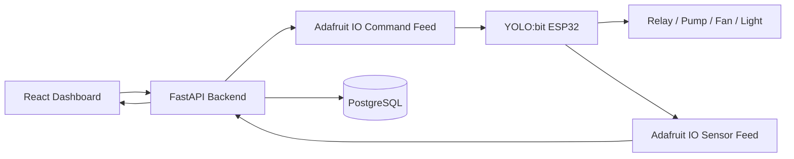
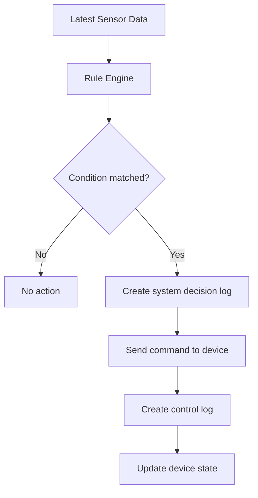

Oke, mình viết tiếp cho bạn **kế hoạch Tuần 3** theo đúng style đã làm với tuần 1 và tuần 2: vừa là **template báo cáo**, vừa là **hướng dẫn triển khai cụ thể để nhóm code luôn**.

Nếu tuần 2 là giai đoạn **data going up**, thì tuần 3 là giai đoạn **control going down**:  
tức là **từ web dashboard → backend → Adafruit IO → thiết bị thật → relay/bơm/quạt/đèn**.  
Đây cũng là tuần bắt đầu tạo ra phần “wow” rõ nhất của đồ án, vì hệ thống không chỉ quan sát mà đã **ra lệnh và tác động ngược lại môi trường thực** theo kiến trúc phân lớp đã chốt [Source](https://www.genspark.ai/api/files/s/HL0PvxQ5)

---

# TEMPLATE BÁO CÁO TUẦN 3  
## Dự án: Hệ thống Vườn Thông Minh Web-based IoT tích hợp AI hỗ trợ quyết định

---

## 1. Giới thiệu tuần 3

Sau khi tuần 2 hoàn thành việc đưa dữ liệu cảm biến thật từ thiết bị lên hệ thống backend và hiển thị trên web dashboard, tuần 3 được xác định là giai đoạn triển khai **điều khiển thiết bị thật từ web** và bắt đầu xây dựng **Auto mode theo ngưỡng**.

Nếu tuần 1 tập trung vào nền tảng kiến trúc và tuần 2 tập trung vào luồng dữ liệu cảm biến, thì tuần 3 là bước chuyển hệ thống từ trạng thái “monitoring” sang “monitoring + control”. Điều này có ý nghĩa rất quan trọng, bởi một hệ thống smart garden hoàn chỉnh không chỉ dừng ở việc hiển thị số liệu mà phải có khả năng tác động lên bơm, quạt và đèn theo lệnh người dùng hoặc theo logic tự động.

Mục tiêu kỹ thuật của tuần 3 là thiết lập được luồng điều khiển hoàn chỉnh từ frontend đến thiết bị thật, đồng thời xây dựng mode vận hành **Manual** và **Auto**, cùng với cơ chế ghi log toàn bộ thao tác và quyết định hệ thống. Cách tổ chức này vẫn giữ nguyên tinh thần phân lớp thiết bị – cloud/backend – frontend của kiến trúc hệ thống ban đầu [Source](https://www.genspark.ai/api/files/s/HL0PvxQ5)

---

## 2. Mục tiêu tuần 3

Tuần 3 hướng tới 4 mục tiêu cốt lõi.

Thứ nhất, người dùng phải có thể điều khiển **bơm, quạt, đèn** từ giao diện web và thiết bị thật phải phản hồi đúng.

Thứ hai, backend phải gửi được lệnh điều khiển qua Adafruit IO hoặc kênh trung gian đã chọn, đồng thời lưu được lịch sử điều khiển vào database.

Thứ ba, hệ thống phải có **Auto mode cơ bản** dựa trên ngưỡng cảm biến, ví dụ:
- đất khô thì bật bơm;
- nhiệt độ cao thì bật quạt;
- ánh sáng thấp thì bật đèn.

Thứ tư, mọi hành động điều khiển đều phải được ghi log rõ ràng để phục vụ báo cáo, debug và demo.

### Deliverable cuối tuần 3
- Web bật/tắt được bơm/quạt/đèn thật.
- Backend gửi lệnh điều khiển thành công.
- Thiết bị nhận lệnh và relay phản hồi đúng.
- Auto mode chạy được với các rule cơ bản.
- Có `control_logs` và `system_decision_logs` hoặc tương đương.
- Demo nội bộ thành công luồng: web → backend → thiết bị.

---

## 3. Phạm vi thực hiện

## 3.1. In-scope
Trong tuần 3, nhóm thực hiện:
- xây API điều khiển thiết bị;
- frontend control panel gửi lệnh;
- backend publish command;
- firmware subscribe command;
- relay điều khiển thật;
- tạo mode Manual / Auto;
- tạo rule engine cơ bản;
- lưu action logs và decision logs;
- hiển thị trạng thái thiết bị trên dashboard.

## 3.2. Out-of-scope
Các nội dung chưa là trọng tâm của tuần 3:
- AI classification từ ảnh;
- AI mode hoàn chỉnh;
- safety rules nâng cao cho AI;
- multi-zone / multi-pot;
- auth/user role chi tiết;
- tối ưu production deployment.

---

## 4. Mục tiêu kỹ thuật cốt lõi của tuần 3

Tuần 3 phải trả lời được câu hỏi:

> “Người dùng có thể bấm nút trên web để điều khiển thiết bị thật hay chưa, và hệ thống có thể tự điều khiển cơ bản theo ngưỡng hay chưa?”

Nếu câu trả lời là **có**, thì nhóm đã hoàn thành cột mốc kỹ thuật quan trọng nhất của phần IoT control.

---

## 5. Kiến trúc tuần 3

Ở tuần 3, hệ thống cần hỗ trợ đồng thời 2 luồng:
- **luồng dữ liệu đi lên** từ cảm biến;
- **luồng lệnh đi xuống** từ web đến relay.



Luồng này thể hiện bản chất của một hệ thống IoT hai chiều: dữ liệu môi trường được gửi lên để quan sát, còn lệnh điều khiển được gửi xuống để tác động lên thiết bị. Đây là bước tiến logic tiếp theo sau tuần 2 và vẫn bám sát kiến trúc phân lớp đã chốt [Source](https://www.genspark.ai/api/files/s/HL0PvxQ5)

---

# 6. Hướng dẫn triển khai cụ thể cho tuần 3

Đây là phần triển khai thực chiến, để nhóm có thể bám vào và code ngay.

---

## 6.1. Chốt chiến lược điều khiển

Tuần 3 nên chọn một cách điều khiển **đơn giản, rõ ràng, dễ debug**.

### Phương án khuyến nghị
Sử dụng **1 command feed** để backend gửi lệnh điều khiển xuống thiết bị.

### Feed khuyến nghị
- `smart-garden-commands`

### Payload command khuyến nghị
```json
{
  "target_device": "pump",
  "action": "on",
  "mode": "manual",
  "requested_by": "user",
  "reason": "manual control from dashboard",
  "requested_at": "2026-03-28T10:30:00Z"
}
```

### Vì sao nên dùng 1 command feed?
- dễ subscribe ở firmware;
- mọi lệnh đi qua cùng một format;
- dễ log và dễ mở rộng;
- không phải tạo 3 feed riêng cho pump/fan/light.

### Fallback nếu firmware parse JSON khó
Có thể dùng format text đơn giản:
```txt
pump:on
fan:off
light:on
```
Nhưng nếu làm được, nhóm nên ưu tiên JSON vì:
- rõ hơn;
- đẹp báo cáo hơn;
- dễ thêm `mode`, `reason`, `timestamp`.

---

## 6.2. Hướng dẫn cho firmware tuần 3

### Mục tiêu firmware
- subscribe command feed;
- parse command;
- bật/tắt relay tương ứng;
- cập nhật LCD hoặc serial log;
- gửi lại trạng thái actuator nếu cần.

### Luồng xử lý khuyến nghị
1. Kết nối Wi-Fi.
2. Kết nối Adafruit IO.
3. Subscribe feed `smart-garden-commands`.
4. Khi có message mới:
   - parse JSON;
   - kiểm tra `target_device`;
   - kiểm tra `action`;
   - bật/tắt relay;
   - ghi log serial;
   - tùy chọn publish state xác nhận.

### Mapping relay gợi ý
- relay 1 → pump
- relay 2 → fan
- relay 3 → light

### Nguyên tắc an toàn firmware
Đây là phần rất quan trọng cho demo:
- relay phải có trạng thái mặc định an toàn khi boot;
- nếu nhận command không hợp lệ thì bỏ qua;
- không bật bơm liên tục vô hạn;
- nên có timeout test khi debug.

### Ví dụ xử lý command
- nếu `target_device = pump` và `action = on` → relay pump = HIGH/LOW tùy wiring;
- nếu lệnh sai → in `"invalid command"` ra serial;
- nếu mất Wi-Fi → giữ trạng thái hiện tại hoặc chuyển safe mode tùy thiết kế.

---

## 6.3. Hướng dẫn cho backend tuần 3

Backend tuần 3 trở thành **điểm điều phối điều khiển**. Nó không chỉ trả API nữa mà còn:
- nhận request từ frontend;
- xác thực lệnh;
- publish lệnh xuống thiết bị;
- ghi log thao tác;
- chạy rule engine của Auto mode.

### 3 chức năng backend bắt buộc

#### 1. Manual command service
Nhận lệnh thủ công từ người dùng.

#### 2. Device control publisher
Gửi command xuống Adafruit IO.

#### 3. Auto rule engine
Tự đưa ra quyết định theo ngưỡng.

---

## 6.4. API cần hoàn thành trong tuần 3

### `POST /api/v1/devices/control`
API gửi lệnh điều khiển thủ công.

Ví dụ request:
```json
{
  "target_device": "pump",
  "action": "on",
  "actor_type": "user",
  "reason": "manual control from dashboard"
}
```

Ví dụ response:
```json
{
  "success": true,
  "message": "Command sent successfully",
  "command_id": "cmd_001"
}
```

---

### `GET /api/v1/devices/state`
Trả trạng thái hiện tại của actuator.

Ví dụ:
```json
{
  "pump_state": true,
  "fan_state": false,
  "light_state": true,
  "mode": "manual",
  "last_updated": "2026-03-28T10:35:00Z"
}
```

---

### `POST /api/v1/system/mode`
Dùng để chuyển mode Manual / Auto / AI.

Ví dụ request:
```json
{
  "mode": "auto"
}
```

Ví dụ response:
```json
{
  "success": true,
  "mode": "auto"
}
```

---

### `GET /api/v1/logs/control`
Trả lịch sử điều khiển.

---

### `GET /api/v1/logs/system-decisions`
Trả lịch sử quyết định hệ thống trong Auto mode.

---

## 6.5. Thiết kế rule engine cho Auto mode

Tuần 3 **không nên làm Auto mode quá phức tạp**. Chỉ cần logic rõ, chạy ổn, dễ giải thích.

### Rule set đề xuất v1

#### Rule 1 – Soil moisture thấp
Nếu `soil_moisture < 30`  
→ bật `pump`

#### Rule 2 – Nhiệt độ cao
Nếu `air_temperature > 32`  
→ bật `fan`

#### Rule 3 – Ánh sáng thấp
Nếu `light_level < 300`  
→ bật `light`

### Rule off cơ bản
- nếu `soil_moisture >= 40` → tắt pump
- nếu `air_temperature <= 30` → tắt fan
- nếu `light_level >= 400` → tắt light

### Quan trọng
Nên có **hysteresis** đơn giản để tránh bật/tắt liên tục.

Ví dụ:
- bật bơm khi dưới 30
- tắt bơm khi trên 40

Nếu dùng cùng một ngưỡng bật/tắt, relay sẽ nhấp nháy liên tục khi giá trị dao động quanh ngưỡng.

---

## 6.6. Luồng Auto mode khuyến nghị



### Tần suất chạy Auto mode
- mỗi 5 giây hoặc 10 giây;
- hoặc mỗi khi có sensor record mới.

### Khuyến nghị thực tế
Nếu backend đã ingest dữ liệu cảm biến theo chu kỳ, hãy để Auto mode chạy **ngay sau khi ingest xong latest data**, vì:
- dễ đồng bộ;
- logic rõ;
- không cần thêm scheduler rườm rà.

---

## 6.7. Thiết kế log tuần 3

Đây là phần cực quan trọng để báo cáo đẹp và demo chắc.

### Nên tách 2 loại log

#### A. `control_logs`
Ghi nhận lệnh điều khiển thực tế.

Ví dụ:
- ai gửi lệnh;
- lệnh gì;
- gửi lúc nào;
- thành công hay thất bại.

#### B. `system_decision_logs`
Ghi nhận lý do hệ thống tự quyết định trong Auto mode.

Ví dụ:
- sensor snapshot lúc ra quyết định;
- rule nào được kích hoạt;
- action đề xuất;
- action đã thực thi hay chưa.

### Ví dụ schema `system_decision_logs`
| Trường | Kiểu |
|---|---|
| id | UUID / SERIAL |
| created_at | TIMESTAMP |
| mode | VARCHAR |
| trigger_type | VARCHAR |
| sensor_snapshot | JSON / TEXT |
| recommended_action | VARCHAR |
| executed | BOOLEAN |
| execution_note | TEXT |

Nếu chưa muốn thêm bảng mới, có thể tạm lưu vào `control_logs.reason`, nhưng tốt nhất nên tách riêng.

---

## 6.8. Hướng dẫn cho frontend tuần 3

Frontend tuần 3 phải có **Control Page thật sự usable**.

### Các thành phần cần có

#### 1. Control toggles
- bật/tắt pump
- bật/tắt fan
- bật/tắt light

#### 2. Mode switch
- Manual
- Auto
- AI (disable hoặc placeholder)

#### 3. Current device status
Hiển thị trạng thái hiện tại:
- Pump: ON/OFF
- Fan: ON/OFF
- Light: ON/OFF
- Mode: current mode

#### 4. Recent control logs
Bảng log ngắn 5–10 dòng gần nhất.

### Hành vi UI khuyến nghị
- nếu đang ở `Auto mode`, disable manual control hoặc hiển thị cảnh báo;
- khi bấm nút điều khiển, hiển thị loading ngắn;
- sau khi thành công, refetch device state;
- hiển thị snackbar/toast “Command sent successfully”.

### Cách xử lý xung đột mode
Nên thống nhất rule:
- `Manual mode`: người dùng điều khiển trực tiếp
- `Auto mode`: rule engine tự điều khiển
- `AI mode`: placeholder, chưa mở ở tuần 3

Khuyến nghị:
- khi chuyển sang Auto mode, frontend disable manual switch;
- khi chuyển về Manual mode, người dùng được điều khiển lại.

---

## 6.9. Đồng bộ trạng thái thiết bị

Một vấn đề hay gặp là frontend nghĩ relay đang ON nhưng thiết bị thật chưa chắc vậy.

### Có 2 cách

#### Cách 1 – Backend assume success
Sau khi gửi command, backend cập nhật state luôn.

Ưu điểm:
- đơn giản;
- đủ cho demo sớm.

Nhược điểm:
- có thể lệch nếu thiết bị không nhận được lệnh.

#### Cách 2 – Firmware gửi state acknowledgement
Sau khi nhận lệnh, firmware publish lại state.

Ưu điểm:
- chính xác hơn.

Nhược điểm:
- phức tạp hơn.

### Khuyến nghị cho tuần 3
- ưu tiên **assume success + test kỹ**;
- nếu còn thời gian thì thêm `device state ack`.

---

# 7. Phân công chi tiết tuần 3

## Thành viên 1 – Embedded / IoT
Phụ trách:
- subscribe command feed;
- parse command;
- điều khiển relay;
- kiểm tra wiring bơm/quạt/đèn;
- test phản hồi thiết bị;
- hỗ trợ debug command flow.

### Deliverable
- thiết bị nhận lệnh và relay phản hồi đúng;
- serial log thể hiện command nhận được;
- test thành công từng actuator.

---

## Thành viên 2 – Backend / Database
Phụ trách:
- xây API `/devices/control`;
- xây API `/system/mode`;
- publish command xuống Adafruit IO;
- lưu `control_logs`;
- xây rule engine Auto mode;
- cập nhật `device_states`.

### Deliverable
- backend gửi lệnh thành công;
- DB có logs điều khiển;
- Auto mode chạy được theo ngưỡng.

---

## Thành viên 3 – Frontend
Phụ trách:
- hoàn thiện Control Page;
- thêm mode switch;
- hiển thị trạng thái actuator;
- gọi API manual control;
- hiển thị recent control logs.

### Deliverable
- control panel dùng được;
- trạng thái thiết bị hiển thị rõ;
- có UX phản hồi sau khi bấm lệnh.

---

## Thành viên 4 – Integration / Docs / QA
Phụ trách:
- viết tài liệu flow điều khiển;
- test xung đột mode;
- kiểm thử rule engine;
- viết báo cáo tuần 3;
- chuẩn bị demo scenario.

### Deliverable
- test checklist tuần 3;
- báo cáo tuần 3;
- bug list và hướng fix.

---

# 8. WBS chi tiết tuần 3 theo ngày

## Day 1 – Chốt contract điều khiển
### Mục tiêu
Thống nhất format command và mode behavior.

### Phải hoàn thành
- chốt `smart-garden-commands` feed;
- chốt command payload;
- chốt rule Manual / Auto;
- chốt frontend behavior khi đổi mode.

### Deliverable
- file `control-contract.md`
- ví dụ command JSON

---

## Day 2 – Firmware subscribe command + relay test
### Mục tiêu
Thiết bị nhận được lệnh và tác động relay.

### Phải hoàn thành
- subscribe command feed;
- parse message;
- điều khiển relay pump/fan/light;
- test từng relay độc lập;
- in serial log.

### Deliverable
- relay phản hồi đúng khi gửi command test;
- có video test ngắn hoặc serial log.

---

## Day 3 – Backend manual control API
### Mục tiêu
Tạo luồng web/backend gửi command thật.

### Phải hoàn thành
- viết `POST /devices/control`;
- validate input;
- publish command;
- lưu `control_logs`;
- cập nhật `device_states`.

### Deliverable
- gọi Postman/API test thành công;
- command xuất hiện trên Adafruit IO;
- log được lưu DB.

---

## Day 4 – Frontend control page hoàn chỉnh
### Mục tiêu
Người dùng bấm nút trên web để gửi lệnh.

### Phải hoàn thành
- tạo toggle/switch control;
- kết nối API control;
- hiển thị toast phản hồi;
- refetch device state;
- hiển thị mode hiện tại.

### Deliverable
- bấm trên web gửi lệnh thành công;
- UI phản hồi ổn.

---

## Day 5 – Auto mode rule engine
### Mục tiêu
Hệ thống tự điều khiển theo ngưỡng cơ bản.

### Phải hoàn thành
- viết rule engine;
- trigger trên latest sensor data;
- gửi command system-generated;
- ghi decision logs;
- test 3 rule chính.

### Deliverable
- Auto mode bật được pump/fan/light theo điều kiện;
- có log giải thích lý do.

---

## Day 6 – Logging + integration stabilization
### Mục tiêu
Làm hệ thống đủ chắc để demo.

### Phải hoàn thành
- hoàn thiện control logs;
- hoàn thiện system decision logs;
- kiểm thử chuyển mode;
- kiểm thử xung đột manual vs auto;
- sửa bug tích hợp.

### Deliverable
- end-to-end chạy ổn;
- logs đầy đủ để mở ra trình bày.

---

## Day 7 – Demo nội bộ tuần 3
### Mục tiêu
Tập dượt demo như bảo vệ thật.

### Kịch bản demo
1. mở dashboard và control page;
2. hiển thị trạng thái hiện tại;
3. bấm bật quạt trên web;
4. thiết bị phản hồi thật;
5. bấm bật đèn;
6. thiết bị phản hồi thật;
7. chuyển sang Auto mode;
8. giả lập đất khô/nhiệt cao/thiếu sáng;
9. hệ thống tự xử lý;
10. mở logs cho thấy lý do và thời gian hành động.

### Deliverable
- video backup demo;
- danh sách lỗi còn lại;
- backlog tuần 4.

---

# 9. Definition of Done cho tuần 3

Tuần 3 chỉ được xem là hoàn thành khi đáp ứng đồng thời các tiêu chí sau:

- frontend gửi được lệnh điều khiển tới backend;
- backend publish được command tới thiết bị;
- thiết bị nhận command và kích relay đúng;
- ít nhất 2–3 actuator được test thành công;
- có chế độ `Manual` và `Auto`;
- Auto mode có ít nhất 3 rule cơ bản;
- điều khiển thủ công và điều khiển tự động đều được lưu log;
- demo nội bộ thành công với thiết bị thật.

---

# 10. Checklist kỹ thuật tuần 3

| Hạng mục | Trạng thái | Ghi chú |
|---|---|---|
| Chốt command feed | [ ] | |
| Chốt JSON command format | [ ] | |
| Firmware subscribe command thành công | [ ] | |
| Relay pump test thành công | [ ] | |
| Relay fan test thành công | [ ] | |
| Relay light test thành công | [ ] | |
| API `/devices/control` chạy đúng | [ ] | |
| API `/system/mode` chạy đúng | [ ] | |
| Frontend control page gọi API thành công | [ ] | |
| Dashboard hiển thị đúng trạng thái actuator | [ ] | |
| Auto mode soil moisture hoạt động | [ ] | |
| Auto mode temperature hoạt động | [ ] | |
| Auto mode light hoạt động | [ ] | |
| `control_logs` lưu đúng | [ ] | |
| `system_decision_logs` lưu đúng | [ ] | |
| Demo nội bộ end-to-end thành công | [ ] | |

---

# 11. Các lỗi phổ biến cần tránh trong tuần 3

## Lỗi 1 – Không khóa hành vi khi chuyển mode
Ví dụ đang Auto mode nhưng user vẫn bấm manual liên tục.

### Cách xử lý
- define rõ behavior từ đầu;
- Auto mode thì disable manual control hoặc yêu cầu switch về Manual trước.

---

## Lỗi 2 – Bật/tắt liên tục do ngưỡng không có hysteresis
Đây là lỗi rất hay gặp ở Auto mode.

### Cách xử lý
- dùng ngưỡng bật khác ngưỡng tắt;
- ví dụ bật bơm khi `< 30`, tắt khi `>= 40`.

---

## Lỗi 3 – Điều khiển thành công trên UI nhưng thiết bị không phản hồi
Do frontend chỉ tin backend response.

### Cách xử lý
- test thực tế với relay;
- log kỹ từng bước;
- nếu kịp, thêm acknowledgement từ firmware.

---

## Lỗi 4 – Không lưu reason trong log
Khi demo thầy hỏi “tại sao hệ thống bật bơm?”, nếu không có log lý do sẽ rất yếu.

### Cách xử lý
Mọi log phải có `reason`, ví dụ:
- `manual control from dashboard`
- `auto mode: soil_moisture below threshold`

---

## Lỗi 5 – Pump chạy quá lâu gây rủi ro
Dù tuần 3 chưa làm AI safety, vẫn phải có basic protection.

### Cách xử lý
- giới hạn thời gian test;
- có nút tắt khẩn cấp;
- kiểm tra relay trước khi nối tải thật.

---

# 12. Kết quả mong đợi cuối tuần 3

Đến cuối tuần 3, nhóm phải có thể trình bày chắc chắn rằng:

> Hệ thống đã hỗ trợ điều khiển hai chiều: người dùng có thể quan sát dữ liệu cảm biến trên dashboard và đồng thời gửi lệnh điều khiển xuống thiết bị thật. Ngoài ra, hệ thống cũng đã có khả năng tự động điều khiển ở mức cơ bản dựa trên ngưỡng môi trường.

Đây là mốc rất quan trọng, vì từ thời điểm này dự án đã có đầy đủ hai phần cốt lõi của một hệ thống IoT:
- **sensing**
- **actuation**

---

# 13. Kế hoạch chuyển tiếp sang tuần 4

Sau khi tuần 3 hoàn thành, tuần 4 sẽ tập trung vào **AI highlight** của dự án:
- nhận diện cây từ ảnh hoặc chọn cây từ danh sách;
- sinh plant profile;
- tạo AI recommendation;
- chuẩn bị AI mode với safety constraints.

Nói ngắn gọn:
- tuần 2: data acquisition
- tuần 3: device control + automation
- tuần 4: AI personalization

---

# 14. Prompt vibe coding cho tuần 3

Dưới đây là prompt ngắn để nhóm dùng với AI assistant.

## Prompt cho firmware
> Viết firmware ESP32 cho Smart Garden có khả năng subscribe Adafruit IO command feed `smart-garden-commands`, parse JSON command gồm `target_device`, `action`, `mode`, `reason`, điều khiển relay cho pump/fan/light, in serial log và giữ trạng thái an toàn khi command không hợp lệ.

## Prompt cho backend
> Cập nhật backend FastAPI cho Smart Garden để hỗ trợ API `/api/v1/devices/control`, `/api/v1/devices/state`, `/api/v1/system/mode`, publish command tới Adafruit IO, lưu `control_logs`, quản lý `device_states`, và triển khai Auto mode rule engine dựa trên soil moisture, air temperature, light level.

## Prompt cho frontend
> Cập nhật frontend React Smart Garden để tạo Control Page hoàn chỉnh gồm toggle pump/fan/light, switch mode Manual/Auto/AI, gọi API control, hiển thị device state hiện tại, recent control logs và disable manual control khi ở Auto mode.

## Prompt cho logging
> Thiết kế schema và service lưu log cho Smart Garden gồm `control_logs` và `system_decision_logs`, đảm bảo mỗi hành động điều khiển hoặc quyết định tự động đều có timestamp, actor_type, reason, status và sensor snapshot nếu cần.

---

# 15. Mẫu nội dung báo cáo tuần 3 – phần “Kết quả đạt được”

Bạn có thể dùng đoạn này khi nộp báo cáo rồi chỉnh theo tình hình thực tế.

Trong tuần 3, nhóm tập trung triển khai chức năng điều khiển thiết bị thật từ giao diện web và xây dựng chế độ vận hành tự động theo ngưỡng môi trường. Ở phía backend, nhóm đã hoàn thiện các API điều khiển thiết bị, quản lý trạng thái hệ thống và lưu lịch sử thao tác vào cơ sở dữ liệu. Đồng thời, backend cũng được mở rộng để gửi command điều khiển qua Adafruit IO xuống thiết bị IoT.

Ở phía thiết bị, firmware đã được cập nhật để nhận lệnh điều khiển từ command feed, thực hiện bật/tắt relay tương ứng với bơm, quạt và đèn. Về phía frontend, nhóm đã hoàn thiện Control Page, cho phép người dùng điều khiển thủ công và chuyển đổi giữa các mode vận hành. Ngoài ra, nhóm cũng đã xây dựng Auto mode cơ bản với các rule theo ngưỡng độ ẩm đất, nhiệt độ và ánh sáng, đồng thời ghi log đầy đủ để phục vụ giám sát và trình bày báo cáo.

Kết quả của tuần 3 cho thấy hệ thống không chỉ quan sát được môi trường mà còn bắt đầu có khả năng điều khiển thiết bị thật và tự động phản ứng với các điều kiện môi trường ở mức cơ bản.

---

# 16. Mẫu kết luận tuần 3

Tuần 3 là giai đoạn đánh dấu sự hoàn thiện phần lõi IoT của hệ thống Smart Garden. Nếu tuần 2 xác lập luồng dữ liệu cảm biến từ thiết bị đến dashboard, thì tuần 3 hoàn thiện chiều ngược lại của hệ thống bằng cách cho phép người dùng điều khiển thiết bị thật từ web và triển khai cơ chế Auto mode theo ngưỡng. Việc hoàn thành thành công tuần 3 chứng minh rằng hệ thống đã đạt được hai năng lực nền tảng của một mô hình smart garden hoàn chỉnh: giám sát môi trường và điều khiển thiết bị. Đây là tiền đề rất quan trọng để bước sang tuần 4, nơi hệ thống sẽ được bổ sung yếu tố AI nhằm cá nhân hóa chiến lược chăm sóc cây trồng và tăng giá trị học thuật cho dự án.

---

Nếu bạn muốn, mình có thể viết tiếp ngay:

**A. Kế hoạch tuần 4** – AI highlight: nhận diện cây, plant profile, AI recommendation, AI mode có giới hạn an toàn  
**B. Action checklist tuần 3 cực chi tiết theo từng người + từng file cần sửa**  
**C. Bản báo cáo tuần 1–2–3 đồng bộ văn phong để ghép thành một bộ hoàn chỉnh**

Nếu mục tiêu của bạn là đi hết mạch luôn, mình khuyên bước tiếp theo là:  
**mình viết tiếp luôn kế hoạch Tuần 4 để nối thẳng sang phần AI.**


from yolobit import *
from mqtt import *
from event_manager import *
from aiot_rgbled import RGBLed
import time
import ujson

# ---------------------------------------------------------
# 1. CẤU HÌNH CHÂN TEST
# ---------------------------------------------------------
# Khởi tạo module LED RGB cắm ở chân P0 (giả sử module có 4 bóng LED)
# Nếu module của bạn có số bóng khác (ví dụ 1 bóng), hãy đổi số 4 thành 1
tiny_rgb = RGBLed(pin0.pin, 4)
tiny_rgb.show(0, hex_to_rgb('#000000')) # Tắt hết đèn khi mới bật

event_manager.reset()

# ---------------------------------------------------------
# 2. HÀM XỬ LÝ LỆNH TỪ BACKEND
# ---------------------------------------------------------
def on_mqtt_message(topic, msg):
    try:
        print("Nhận được tin nhắn từ feed:", topic)
        print("Nội dung:", msg)
        
        # Parse JSON
        command = ujson.loads(msg)
        target = command.get("target_device")
        action = command.get("action")
        
        # Xác định trạng thái: "on" -> 1, "off" -> 0
        state = 1 if action == "on" else 0
        
        # Xử lý lệnh cho thiết bị LIGHT (Dùng LED RGB ở P0)
        if target == "light":
            if state == 1:
                # Bật đèn (Ví dụ màu Trắng: #FFFFFF, Đỏ: #FF0000, Xanh: #00FF00)
                tiny_rgb.show(0, hex_to_rgb('#FFFFFF')) 
                print("-> Đã BẬT Đèn (Light)")
            else:
                # Tắt đèn
                tiny_rgb.show(0, hex_to_rgb('#000000')) 
                print("-> Đã TẮT Đèn (Light)")
            display.scroll("L")
            
        # Xử lý lệnh cho FAN (Giả lập in ra màn hình)
        elif target == "fan":
            print("-> Đã", "BẬT" if state else "TẮT", "Quạt (Fan)")
            display.scroll("F")
            
        # Xử lý lệnh cho PUMP (Giả lập in ra màn hình)
        elif target == "pump":
            print("-> Đã", "BẬT" if state else "TẮT", "Bơm (Pump)")
            display.scroll("P")
            
    except Exception as e:
        print("Lỗi khi parse lệnh:", e)

# ---------------------------------------------------------
# 3. HÀM GỬI DỮ LIỆU CẢM BIẾN
# ---------------------------------------------------------
def on_event_timer_callback():
    payload = ujson.dumps({
        "light_level": light_level(),
        "air_temperature": temperature(),
        "soil_moisture": 20 
    })
    mqtt.publish('dadn-temperature', payload)
    print("Đã gửi dữ liệu cảm biến:", payload)

event_manager.add_timer_event(10000, on_event_timer_callback)

# ---------------------------------------------------------
# 4. KHỞI TẠO KẾT NỐI
# ---------------------------------------------------------
if True:
    display.scroll('TEST')
    mqtt.connect_wifi('FPT Lang 2', '99999999')
    mqtt.connect_broker(server='io.adafruit.com', port=1883, username='', password='')
    
    # SỬA LỖI Ở ĐÂY: Dùng hàm on_receive và subscribe đúng tên feed điều khiển
    mqtt.on_receive = on_mqtt_message
    mqtt.subscribe = 'smart-garden-commands'
    
    display.scroll('OK')
    print("Đã kết nối và subscribe thành công!")

# ---------------------------------------------------------
# 5. VÒNG LẶP CHÍNH
# ---------------------------------------------------------
while True:
    mqtt.check_message()
    event_manager.run()
    time.sleep_ms(100)