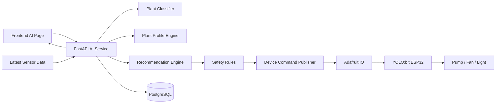

Oke, dưới đây là **Kế hoạch Tuần 4 – AI Highlight** theo đúng format các tuần trước: vừa dùng làm **template báo cáo**, vừa là **hướng dẫn triển khai cụ thể** để nhóm bám vào và code.  

Tuần 4 là tuần tạo “điểm nhấn học thuật” cho dự án. Nếu tuần 2 chứng minh hệ thống đọc được dữ liệu thật và tuần 3 chứng minh hệ thống điều khiển được thiết bị thật, thì tuần 4 phải chứng minh rằng hệ thống **không chỉ tự động theo ngưỡng**, mà còn **bắt đầu cá nhân hóa chăm sóc theo loại cây** thông qua AI và lớp an toàn. Kiến trúc vẫn giữ tinh thần thiết bị → Adafruit IO → backend → frontend như sơ đồ nhóm đã chốt từ đầu [Source](https://www.genspark.ai/api/files/s/HL0PvxQ5)

---

# TEMPLATE BÁO CÁO TUẦN 4  
## Dự án: Hệ thống Vườn Thông Minh Web-based IoT tích hợp AI hỗ trợ quyết định

---

## 1. Giới thiệu tuần 4

Sau khi hoàn thành tuần 3 với chức năng điều khiển thiết bị thật từ web và chế độ Auto mode theo ngưỡng, tuần 4 được xác định là giai đoạn bổ sung **AI highlight** cho hệ thống Smart Garden. Đây là phần giúp dự án vượt ra khỏi mức “IoT cơ bản” để tiến tới một hệ thống có khả năng **nhận biết loại cây**, **sinh profile chăm sóc**, **đưa ra khuyến nghị**, và tiến xa hơn là **hỗ trợ tự điều khiển trong giới hạn an toàn**.  

Về mặt kỹ thuật, tuần 4 không nhằm xây dựng một mô hình AI quá lớn hay quá phức tạp, mà tập trung vào một hướng AI vừa sức nhưng đủ ấn tượng cho demo: từ ảnh cây hoặc lựa chọn loài cây, hệ thống xác định profile chăm sóc ban đầu, sau đó kết hợp với dữ liệu cảm biến hiện tại để đưa ra khuyến nghị hoặc hành động điều khiển có giải thích. Cách tiếp cận này phù hợp với quỹ thời gian ngắn, ít dữ liệu nội bộ và vẫn bám theo kiến trúc phân lớp đã thống nhất [Source](https://www.genspark.ai/api/files/s/HL0PvxQ5)

---

## 2. Mục tiêu tuần 4

Tuần 4 hướng tới 4 mục tiêu cốt lõi.

Thứ nhất, hệ thống phải có chức năng **xác định loại cây** bằng một trong hai cách: upload ảnh để AI phân loại, hoặc chọn cây từ danh sách như một phương án fallback.

Thứ hai, hệ thống phải có **plant profile** cho từng loại cây, bao gồm các ngưỡng chăm sóc cơ bản như độ ẩm đất, nhiệt độ, ánh sáng và thời lượng tưới gợi ý.

Thứ ba, backend phải tạo được **AI recommendation** dựa trên loại cây và dữ liệu cảm biến hiện tại, đồng thời trả về phần giải thích để frontend hiển thị.

Thứ tư, nếu nhóm mở AI mode tự chạy, mọi quyết định AI phải đi qua **Safety Rules** trước khi được phép kích hoạt thiết bị thật.

### Deliverable cuối tuần 4
- Upload ảnh cây hoặc chọn cây từ danh sách.
- Trả về loại cây dự đoán hoặc loại cây được chọn.
- Hệ thống sinh ra plant profile.
- Có AI recommendation từ sensor + profile.
- Có AI mode cơ bản với giới hạn an toàn.
- Có explanation/log cho quyết định AI.

---

## 3. Phạm vi thực hiện

## 3.1. In-scope
Trong tuần 4, nhóm thực hiện:
- chuẩn bị dataset công khai nhỏ hoặc tập ảnh rút gọn;
- huấn luyện mô hình phân loại mức MVP hoặc dựng fallback chọn cây;
- thiết kế plant profile schema và dữ liệu mẫu;
- xây API AI classify / profile / recommendation;
- xây AI page trên frontend;
- xây safety rules cho AI mode;
- ghi AI decisions log.

## 3.2. Out-of-scope
Các nội dung chưa là trọng tâm của tuần 4:
- huấn luyện mô hình lớn với nhiều lớp cây;
- tối ưu accuracy ở mức nghiên cứu;
- reinforcement learning;
- dự báo chuỗi thời gian phức tạp;
- multi-zone AI riêng cho nhiều chậu.

---

## 4. Mục tiêu kỹ thuật cốt lõi của tuần 4

Tuần 4 phải trả lời được câu hỏi:

> “Hệ thống có thể cá nhân hóa khuyến nghị chăm sóc theo loại cây, và nếu AI đề xuất hành động thì hành động đó có bị ràng buộc bởi các rule an toàn hay không?”

Nếu câu trả lời là **có**, thì nhóm đã tạo được phần AI đúng nghĩa cho demo: không phải AI trang trí, mà là AI gắn vào logic vận hành thực tế.

---

## 5. Kiến trúc AI tuần 4

Tuần 4 bổ sung một nhánh AI vào kiến trúc hiện có. Luồng tổng quát sẽ như sau:



Kiến trúc này cho thấy AI không điều khiển trực tiếp thiết bị. Thay vào đó, AI chỉ đi qua các lớp: nhận dạng cây → profile → recommendation → safety rules → command. Cách phân lớp này giúp hệ thống dễ giải thích hơn trong báo cáo và an toàn hơn khi demo với thiết bị thật [Source](https://www.genspark.ai/api/files/s/HL0PvxQ5)

---

# 6. Hướng dẫn triển khai cụ thể cho tuần 4

Đây là phần quan trọng nhất để nhóm triển khai.

---

## 6.1. Chốt chiến lược AI thực tế cho MVP

Tuần 4 không nên cố “làm AI cho thật nhiều”, mà nên khóa một hướng ngắn gọn nhưng chắc.

### Phương án A – Ưu tiên
**Ảnh cây → AI phân loại nhóm cây → sinh plant profile → recommendation**

### Phương án B – Fallback an toàn
**Người dùng chọn loại cây từ danh sách → sinh plant profile → recommendation**

### Khuyến nghị thực tế
Nhóm nên triển khai **cả hai**:
- A để tạo hiệu ứng demo “wow”;
- B để đảm bảo buổi demo không chết nếu model ảnh nhận sai.

Đây là chiến lược rất quan trọng: AI ảnh là điểm nhấn, nhưng plant selector là “đường cứu hộ” để vẫn trình bày được phần AI mode trọn vẹn.

---

## 6.2. Chọn bài toán AI đúng mức

### Bài toán nên làm
Không nên phân loại quá chi tiết hàng chục loại cây ngay từ đầu. Nhóm chỉ nên phân loại theo **3–5 nhóm cây đủ khác biệt về chăm sóc**, ví dụ:
- cactus / succulent
- herb / rau thơm
- leafy ornamental / cây lá
- moisture-loving plant / cây ưa ẩm
- flowering plant / cây hoa

### Vì sao nên gom nhóm?
Dataset [PlantVillage](https://www.tensorflow.org/datasets/catalog/plant_village) có 54,303 ảnh và 38 nhãn, chủ yếu cho lá cây khỏe/bệnh; nếu nhóm cố giữ nguyên toàn bộ 38 nhãn thì sẽ quá nặng và không cần thiết cho MVP. Hợp lý nhất là dùng nó như nguồn tham khảo hoặc trích một tập con nhỏ rồi ánh xạ về vài nhóm cây/phong cách chăm sóc phù hợp với Smart Garden MVP [Source](https://www.tensorflow.org/datasets/catalog/plant_village)

---

## 6.3. Chọn hướng mô hình phù hợp thời gian

### Khuyến nghị tốt nhất cho tuần 4
Dùng **transfer learning** với một model nhẹ như MobileNetV2/MobileNet-based classifier thay vì train từ đầu. Theo hướng dẫn chính thức của TensorFlow, transfer learning tận dụng một mô hình đã được huấn luyện trước trên tập lớn để tái sử dụng các feature map đã học, nhờ đó tiết kiệm đáng kể thời gian và dữ liệu khi làm bài toán phân loại ảnh mới [Source](https://www.tensorflow.org/tutorials/images/transfer_learning)

### Workflow mô hình gợi ý
Ở mức cao, nhóm chỉ cần đi theo 5 bước chuẩn:
1. chuẩn bị và hiểu dữ liệu;
2. xây input pipeline;
3. nạp pretrained base model;
4. thêm classification head cho số lớp mới;
5. train và evaluate nhanh.  
Đây cũng là đúng mạch TensorFlow khuyến nghị cho bài toán image classification với limited time/data [Source](https://www.tensorflow.org/tutorials/images/transfer_learning)

### Nếu nhóm muốn giữ Python đơn giản
Vẫn có thể để backend FastAPI là trung tâm, còn model inference nằm trong một service Python dùng TensorFlow/Keras. Nghĩa là phần AI không phá vỡ stack hiện tại; nó chỉ là một module Python bổ sung chạy cùng backend.

---

## 6.4. Dataset strategy cho tuần 4

### Nguồn dataset nên dùng
Một nguồn chính thức dễ viện dẫn là [PlantVillage](https://www.tensorflow.org/datasets/catalog/plant_village), gồm 54,303 ảnh lá khỏe và bệnh trên 38 lớp. Tuy nhiên, MVP không cần dùng toàn bộ mà chỉ cần:
- lấy cảm hứng từ cấu trúc dữ liệu;
- chọn tập con nhỏ;
- hoặc tự tạo bộ dữ liệu mini theo 3–5 nhóm cây liên quan đến demo [Source](https://www.tensorflow.org/datasets/catalog/plant_village)

### Cách rút gọn dataset hợp lý
Nhóm nên tạo một dataset MVP khoảng:
- 3–5 lớp;
- mỗi lớp 80–150 ảnh nếu có thể;
- tổng khoảng 300–600 ảnh là đủ để demo mức cơ bản.

### Nguồn dữ liệu thực tế nên chuẩn bị
- ảnh công khai nhỏ từ dataset có sẵn;
- ảnh nhóm tự chụp thêm để test inference;
- 1 thư mục `demo_test_images/` để đảm bảo buổi demo có ảnh sạch, dễ nhận đúng.

### Gợi ý thực chiến
Đừng để model phải đoán các cây quá giống nhau. Hãy chọn những nhóm có đặc điểm hình ảnh tương đối khác:
- xương rồng/sen đá;
- rau thơm lá nhỏ;
- cây lá rộng xanh;
- cây ưa ẩm hoặc cây hoa.

---

## 6.5. Thiết kế Plant Profile

Plant profile là phần rất quan trọng vì đây mới là “cầu nối” từ AI nhận diện sang hành động chăm sóc.

### Mỗi profile nên có
- `plant_name`
- `plant_group`
- `soil_threshold_min`
- `soil_threshold_target`
- `temp_threshold_max`
- `light_threshold_min`
- `watering_duration_sec`
- `notes`
- `care_summary`

### Ví dụ plant profile
```json
{
  "plant_name": "Cactus",
  "plant_group": "succulent",
  "soil_threshold_min": 20,
  "soil_threshold_target": 35,
  "temp_threshold_max": 34,
  "light_threshold_min": 500,
  "watering_duration_sec": 5,
  "notes": "Avoid overwatering",
  "care_summary": "Needs dry soil and strong light"
}
```

### Ý nghĩa
AI không cần phải “biết chăm cây” bằng ma thuật. AI chỉ cần:
1. xác định cây hoặc nhóm cây;
2. ánh xạ cây vào profile chăm sóc;
3. dùng profile đó để sinh recommendation.

Cách làm này rất đẹp khi viết báo cáo vì nó cho thấy hệ thống kết hợp **classification + knowledge-based rule mapping**.

---

## 6.6. Thiết kế Recommendation Engine

Recommendation engine là nơi kết hợp:
- loại cây / plant profile;
- latest sensor data;
- mode hiện tại;
- safety rules.

### Input
- loại cây dự đoán hoặc cây được chọn;
- độ tin cậy dự đoán;
- latest sensor data;
- profile chăm sóc.

### Output
- recommendation text;
- action suggested;
- explanation;
- safety status;
- executed hay chưa.

### Ví dụ logic recommendation
Nếu:
- cây thuộc nhóm `succulent`
- `soil_moisture = 18`
- `soil_threshold_min = 20`

thì:
- recommendation = “Soil is below the minimum threshold for succulent profile”
- action_suggested = `pump_on_short`
- explanation = “Current soil moisture is lower than minimum profile threshold”
- executed = `false` nếu chỉ là suggest mode

### 3 mức AI output nên hỗ trợ
#### Mức 1 – Informational
Chỉ hiển thị profile và khuyến nghị.

#### Mức 2 – Suggestion
Đề xuất hành động nhưng chờ user xác nhận.

#### Mức 3 – AI mode
Tự gửi action, nhưng bắt buộc phải qua safety rules.

Tuần 4 nên cố hoàn thành chắc **Mức 1 + Mức 2**, còn **Mức 3** làm ở mức cơ bản nhưng phải an toàn.

---

## 6.7. Thiết kế Safety Rules cho AI mode

Đây là phần ăn điểm nhất nếu trình bày tốt.

### Nguyên tắc
AI **không được phép** điều khiển thiết bị trực tiếp mà không qua kiểm tra.

### Safety rules tối thiểu cho pump
- mỗi lần bật tối đa `5–10 giây`;
- không quá `3 lần trong 1 giờ`;
- không bật nếu cảm biến đất lỗi;
- không bật nếu hệ thống đang ở Manual mode;
- không bật nếu vừa có một lần tưới rất gần trước đó.

### Safety rules cho fan
- chỉ bật khi nhiệt độ vượt ngưỡng trong 2 lần đo liên tiếp;
- không bật/tắt liên tục trong khoảng thời gian quá ngắn.

### Safety rules cho light
- chỉ bật nếu thiếu sáng kéo dài;
- không bật nếu đang ngoài khung thời gian demo cấu hình.

### Pseudocode gợi ý
```python
if mode == "ai":
    recommendation = ai_engine.recommend(profile, latest_sensor)
    if safety_engine.allow(recommendation, latest_sensor, recent_logs):
        execute_command()
    else:
        save_blocked_decision()
```

### Điểm quan trọng khi báo cáo
Cần nhấn mạnh:
> AI chỉ đóng vai trò đề xuất hoặc quyết định cấp cao; lớp Safety Rules mới là lớp quyết định cuối cùng có cho phép hành động thực thi hay không.

Điều này rất phù hợp với cách xây hệ thống cyber-physical an toàn.

---

## 6.8. API cần hoàn thành trong tuần 4

### `POST /api/v1/ai/classify-plant`
Input:
- file ảnh hoặc image URL

Output:
```json
{
  "predicted_plant": "Cactus",
  "plant_group": "succulent",
  "confidence": 0.87
}
```

### `GET /api/v1/ai/profile/{plant_name}`
Output:
```json
{
  "plant_name": "Cactus",
  "soil_threshold_min": 20,
  "soil_threshold_target": 35,
  "temp_threshold_max": 34,
  "light_threshold_min": 500,
  "watering_duration_sec": 5,
  "care_summary": "Needs dry soil and strong light"
}
```

### `POST /api/v1/ai/recommend`
Input:
```json
{
  "plant_name": "Cactus",
  "sensor_snapshot": {
    "air_temperature": 31.5,
    "air_humidity": 62.0,
    "soil_moisture": 18.0,
    "light_level": 420.0
  }
}
```

Output:
```json
{
  "recommendation": "Soil moisture is below the recommended minimum for cactus.",
  "action_suggested": "pump_on_short",
  "explanation": "Current soil moisture 18.0 is below profile minimum 20.0",
  "safety_checked": true,
  "allowed_to_execute": true
}
```

### `POST /api/v1/system/mode`
Vẫn dùng endpoint cũ, nhưng tuần 4 phải hỗ trợ thêm:
```json
{
  "mode": "ai"
}
```

### `GET /api/v1/logs/ai-decisions`
Trả log AI decisions để frontend hiển thị.

---

## 6.9. Thiết kế log cho AI

Nên có bảng `ai_decisions` hoặc `ai_logs` riêng.

### Gợi ý schema
| Trường | Kiểu |
|---|---|
| id | UUID / SERIAL |
| created_at | TIMESTAMP |
| predicted_plant | VARCHAR |
| confidence | FLOAT |
| profile_used | JSON / TEXT |
| sensor_snapshot | JSON / TEXT |
| recommendation | TEXT |
| action_suggested | VARCHAR |
| safety_checked | BOOLEAN |
| allowed_to_execute | BOOLEAN |
| execution_result | VARCHAR |
| explanation | TEXT |

### Vì sao phải có log này?
Khi demo, giảng viên thường hỏi:
- tại sao AI lại đề xuất tưới?
- dựa trên dữ liệu nào?
- vì sao được phép hoặc không được phép thực thi?

Nếu có `ai_decisions`, bạn trả lời cực chắc.

---

## 6.10. Hướng dẫn cho frontend AI Page

AI page tuần 4 phải là nơi “trình diễn” được AI rõ ràng.

### Các thành phần cần có

#### 1. Image upload area
Cho user upload ảnh cây.

#### 2. Plant selector fallback
Dropdown chọn loại cây nếu model ảnh chưa ổn.

#### 3. Classification result card
Hiển thị:
- predicted plant
- confidence
- plant group

#### 4. Plant profile card
Hiển thị:
- soil threshold
- temp threshold
- light threshold
- care summary

#### 5. Recommendation panel
Hiển thị:
- current sensor snapshot
- recommendation
- explanation
- allowed/blocked status

#### 6. AI mode toggle
Cho phép bật `AI mode`.

#### 7. AI decision history
Hiển thị 5–10 log AI gần nhất.

### Hành vi UI khuyến nghị
- nếu classify thất bại, hiện ngay nút “Select plant manually”;
- nếu confidence thấp, hiển thị cảnh báo “Low confidence – manual confirmation recommended”;
- nếu AI action bị safety block, highlight bằng màu vàng hoặc đỏ;
- nếu allowed, hiển thị badge xanh.

---

## 6.11. Chốt chiến lược explainability

Đây là thứ giúp AI trông “thật” và “có tư duy”.

### Mỗi recommendation nên có explanation theo template
- **Plant:** Cactus
- **Sensor status:** Soil moisture is 18
- **Profile rule:** Minimum recommended is 20
- **Suggested action:** Pump ON for 5 seconds
- **Safety result:** Allowed because watering frequency is within limit

### Đây là lý do rất quan trọng
Bạn không cần mô hình quá mạnh, nhưng nếu hệ thống giải thích rõ:
- dữ liệu gì đầu vào;
- rule nào được dùng;
- vì sao được/không được hành động;

thì buổi demo sẽ thuyết phục hơn rất nhiều.

---

## 6.12. Fallback plan nếu model ảnh gặp vấn đề

Tuần 4 rất dễ vỡ vì AI image classification là phần rủi ro nhất.

### Kế hoạch fallback bắt buộc nên chuẩn bị
#### Fallback 1
Nếu model accuracy thấp:
- chỉ dùng 3 lớp cây.

#### Fallback 2
Nếu model inference lỗi:
- cho user chọn cây từ danh sách.

#### Fallback 3
Nếu upload ảnh chưa xong:
- preload sẵn 3 ảnh demo trong hệ thống.

#### Fallback 4
Nếu thời gian quá gấp:
- bỏ classify thật;
- chỉ giữ plant selector + profile + recommendation + safety AI mode.

Điều quan trọng là:
> Dù model ảnh có trục trặc, phần “AI decision support” vẫn phải sống được.

---

# 7. Phân công chi tiết tuần 4

## Thành viên 1 – Embedded / IoT
Phụ trách:
- hỗ trợ test AI mode trên thiết bị thật;
- kiểm tra command từ AI đi xuống relay;
- đảm bảo basic safety ở firmware;
- hỗ trợ test giới hạn thời gian bơm/quạt/đèn.

### Deliverable
- thiết bị phản hồi đúng với command do AI mode sinh ra;
- có giới hạn test an toàn cơ bản.

---

## Thành viên 2 – Backend / Database
Phụ trách:
- xây AI APIs;
- thiết kế `plant_profiles` và `ai_decisions`;
- viết recommendation engine;
- viết safety rules engine;
- tích hợp AI mode với command publisher.

### Deliverable
- classify/profile/recommend APIs chạy được;
- AI mode hoạt động ở backend;
- DB lưu được AI logs.

---

## Thành viên 3 – Frontend
Phụ trách:
- hoàn thiện AI page;
- upload ảnh;
- plant selector fallback;
- hiển thị classification result;
- hiển thị profile và recommendation;
- hiển thị AI decision history.

### Deliverable
- AI page dùng được;
- có flow rõ ràng từ ảnh/chọn cây đến recommendation.

---

## Thành viên 4 – AI / Integration / Docs
Phụ trách:
- chuẩn bị dataset;
- train model nhẹ;
- export model;
- viết script inference;
- đánh giá accuracy cơ bản;
- viết báo cáo tuần 4.

### Deliverable
- model demo chạy được hoặc fallback hoàn thiện;
- có tài liệu mô tả workflow AI;
- có bảng kết quả test.

---

# 8. WBS chi tiết tuần 4 theo ngày

## Day 1 – Chốt AI scope và fallback
### Mục tiêu
Khóa bài toán AI cho vừa sức.

### Phải hoàn thành
- chốt 3–5 lớp cây;
- chốt plan A và plan B fallback;
- chốt schema `plant_profiles`;
- chốt API AI.

### Deliverable
- file `ai-scope.md`
- file `plant-profiles-seed.json`

---

## Day 2 – Chuẩn bị dataset và baseline model
### Mục tiêu
Có dữ liệu và baseline đầu tiên.

### Phải hoàn thành
- thu thập/rút gọn dataset;
- chia train/val/test;
- huấn luyện baseline;
- test vài ảnh mẫu.

### Deliverable
- thư mục dataset sạch;
- baseline model hoặc notebook huấn luyện;
- kết quả accuracy ban đầu.

---

## Day 3 – AI inference API + profile service
### Mục tiêu
Backend gọi được model và trả profile.

### Phải hoàn thành
- xây `classify-plant` API;
- xây `profile/{plant_name}` API;
- ánh xạ từ class → plant profile;
- test bằng Postman hoặc script.

### Deliverable
- classify được 1 ảnh test;
- trả profile tương ứng.

---

## Day 4 – Recommendation engine + explanation
### Mục tiêu
Sinh được khuyến nghị từ profile + sensor.

### Phải hoàn thành
- lấy latest sensor data;
- so với profile;
- sinh recommendation;
- sinh explanation text;
- lưu `ai_decisions`.

### Deliverable
- API `recommend` hoạt động;
- có AI decision log.

---

## Day 5 – Safety rules + AI mode
### Mục tiêu
AI có thể đề xuất/tự chạy nhưng bị ràng buộc an toàn.

### Phải hoàn thành
- viết safety engine;
- chặn action nguy hiểm;
- hỗ trợ mode AI;
- publish command nếu được phép.

### Deliverable
- action được phép thì thực thi;
- action không an toàn thì bị block và có log.

---

## Day 6 – Frontend AI page + integration
### Mục tiêu
Làm phần AI nhìn được, demo được.

### Phải hoàn thành
- upload ảnh;
- plant selector fallback;
- hiển thị result/profile/recommendation;
- hiển thị allowed/blocked;
- hiển thị decision history.

### Deliverable
- AI page chạy end-to-end;
- có flow hoàn chỉnh cho demo.

---

## Day 7 – Demo nội bộ tuần 4
### Mục tiêu
Tập dượt AI highlight như demo thật.

### Kịch bản demo
1. mở AI page;
2. upload ảnh cây hoặc chọn cây;
3. hệ thống trả loại cây;
4. hệ thống sinh profile chăm sóc;
5. hiển thị latest sensor data;
6. AI đưa recommendation;
7. bật AI mode;
8. hệ thống thực thi nếu an toàn hoặc block nếu vi phạm rule;
9. mở log giải thích quyết định.

### Deliverable
- video backup AI demo;
- bug list còn lại;
- backlog tuần 5.

---

# 9. Definition of Done cho tuần 4

Tuần 4 chỉ được xem là hoàn thành khi đáp ứng đồng thời các tiêu chí sau:

- có flow upload ảnh hoặc chọn cây;
- classify được ít nhất vài ảnh demo hoặc fallback hoạt động chắc;
- plant profile được sinh và hiển thị;
- recommendation engine hoạt động với latest sensor data;
- AI explanation hiển thị rõ;
- AI mode có safety rules cơ bản;
- action AI được log;
- demo nội bộ thành công end-to-end.

---

# 10. Checklist kỹ thuật tuần 4

| Hạng mục | Trạng thái | Ghi chú |
|---|---|---|
| Chốt 3–5 lớp cây | [ ] | |
| Chuẩn bị dataset MVP | [ ] | |
| Baseline model train xong | [ ] | |
| API `/ai/classify-plant` chạy | [ ] | |
| API `/ai/profile/{plant}` chạy | [ ] | |
| API `/ai/recommend` chạy | [ ] | |
| `plant_profiles` seed xong | [ ] | |
| `ai_decisions` schema xong | [ ] | |
| Recommendation engine hoạt động | [ ] | |
| Explanation text hoạt động | [ ] | |
| Safety rules cho pump xong | [ ] | |
| Safety rules cho fan xong | [ ] | |
| Safety rules cho light xong | [ ] | |
| AI mode hoạt động | [ ] | |
| Fallback manual plant selector hoạt động | [ ] | |
| AI page frontend hoàn chỉnh | [ ] | |
| Demo nội bộ AI highlight thành công | [ ] | |

---

# 11. Các lỗi phổ biến cần tránh trong tuần 4

## Lỗi 1 – Ôm model quá lớn
Nhiều nhóm cố phân loại quá nhiều loài cây, dẫn đến train lâu, accuracy thấp, demo rủi ro.

### Cách xử lý
- giảm về 3–5 lớp;
- ưu tiên nhóm cây khác biệt rõ.

---

## Lỗi 2 – AI không gắn với logic hệ thống
Nếu AI chỉ trả ra tên cây mà không ảnh hưởng gì đến recommendation, phần AI sẽ trông rất rời rạc.

### Cách xử lý
- bắt buộc ánh xạ sang plant profile;
- từ profile phải sinh recommendation.

---

## Lỗi 3 – Không có fallback
Nếu model ảnh lỗi thì cả AI page chết.

### Cách xử lý
- luôn có plant selector fallback;
- luôn có ảnh demo chuẩn bị sẵn.

---

## Lỗi 4 – AI tự điều khiển không có safety
Đây là lỗi rất nguy hiểm khi demo với thiết bị thật.

### Cách xử lý
- mọi action phải qua safety engine;
- log rõ blocked/allowed.

---

## Lỗi 5 – Không có explanation
Nếu AI chỉ hiện “pump_on_short” mà không giải thích, giảng viên rất khó thấy giá trị.

### Cách xử lý
- explanation bắt buộc phải có:
  - sensor hiện tại;
  - threshold profile;
  - action;
  - safety result.

---

# 12. Kết quả mong đợi cuối tuần 4

Đến cuối tuần 4, nhóm phải có thể trình bày chắc chắn rằng:

> Hệ thống không chỉ tự động theo ngưỡng chung, mà đã bắt đầu cá nhân hóa chiến lược chăm sóc dựa trên loại cây. AI có thể nhận diện hoặc xác định nhóm cây, sinh profile chăm sóc, phân tích dữ liệu cảm biến hiện tại và đưa ra quyết định có giải thích. Nếu AI mode được bật, mọi hành động thực thi đều bị ràng buộc bởi các rule an toàn.

Đây chính là câu “ăn điểm” nhất của toàn bộ dự án.

---

# 13. Kế hoạch chuyển tiếp sang tuần 5

Sau khi tuần 4 hoàn thành, tuần 5 sẽ tập trung vào:
- làm đẹp dashboard;
- hoàn thiện chart và logs;
- hoàn thiện báo cáo kiến trúc, ERD, use case, sequence;
- chuẩn bị kịch bản demo;
- test lỗi và quay video backup.

Nói ngắn gọn:
- tuần 2: sensor data
- tuần 3: control + auto
- tuần 4: AI highlight
- tuần 5: polish + report + defense readiness

---

# 14. Prompt vibe coding cho tuần 4

## Prompt cho AI model
> Tạo baseline image classification pipeline cho Smart Garden với 3–5 lớp cây, dùng transfer learning từ MobileNetV2, dữ liệu nhỏ, mục tiêu demo nhanh. Trả ra script train, evaluate và export model inference.

## Prompt cho backend
> Cập nhật backend FastAPI cho Smart Garden để hỗ trợ `/api/v1/ai/classify-plant`, `/api/v1/ai/profile/{plant_name}`, `/api/v1/ai/recommend`, lưu `ai_decisions`, ánh xạ class cây sang plant profile, và thêm safety rules trước khi AI mode gửi command xuống thiết bị.

## Prompt cho frontend
> Tạo AI page cho Smart Garden bằng React + MUI, hỗ trợ upload ảnh cây, fallback chọn cây từ dropdown, hiển thị predicted plant, confidence, plant profile, AI recommendation, explanation, allowed/blocked status và decision history.

## Prompt cho safety engine
> Thiết kế safety engine cho Smart Garden AI mode: giới hạn thời gian bật pump, giới hạn số lần tưới trong 1 giờ, chặn hành động khi cảm biến lỗi, chặn điều khiển khi mode không hợp lệ, và trả explanation rõ ràng cho từng quyết định allowed hoặc blocked.

---

# 15. Mẫu nội dung báo cáo tuần 4 – phần “Kết quả đạt được”

Bạn có thể dùng đoạn này khi nộp báo cáo rồi chỉnh lại theo thực tế.

Trong tuần 4, nhóm tập trung triển khai mô-đun AI nhằm tạo điểm nhấn cho hệ thống Smart Garden. Nhóm đã xây dựng được luồng xử lý cho phép người dùng upload ảnh cây hoặc lựa chọn loại cây từ danh sách, từ đó hệ thống xác định nhóm cây và sinh ra profile chăm sóc tương ứng. Trên cơ sở profile này, backend kết hợp dữ liệu cảm biến hiện tại để tạo ra khuyến nghị chăm sóc và phần giải thích đi kèm.

Song song với đó, nhóm cũng triển khai cơ chế AI mode ở mức MVP, trong đó mọi hành động điều khiển do AI đề xuất đều phải đi qua một lớp kiểm tra an toàn trước khi được phép thực thi. Các quyết định AI, bao gồm cả quyết định được phép và bị chặn, đều được lưu lại vào cơ sở dữ liệu để phục vụ giám sát và trình bày báo cáo. Kết quả của tuần 4 cho thấy hệ thống đã bắt đầu chuyển từ mô hình tự động hóa theo ngưỡng cố định sang mô hình chăm sóc mang tính cá nhân hóa theo từng nhóm cây.

---

# 16. Mẫu kết luận tuần 4

Tuần 4 là giai đoạn bổ sung giá trị học thuật nổi bật cho dự án Smart Garden thông qua mô-đun AI hỗ trợ quyết định. Nếu các tuần trước tập trung vào thu thập dữ liệu và điều khiển thiết bị, thì tuần này mở rộng hệ thống theo hướng thông minh hơn: hệ thống có thể nhận diện hoặc xác định loại cây, ánh xạ sang profile chăm sóc, phân tích trạng thái môi trường hiện tại và đưa ra khuyến nghị có giải thích. Quan trọng hơn, mọi hành động điều khiển do AI đề xuất đều phải tuân thủ các ràng buộc an toàn, giúp hệ thống vừa có tính thông minh vừa có tính kiểm soát. Đây là nền tảng quan trọng để bước sang tuần 5, nơi nhóm sẽ hoàn thiện giao diện, báo cáo và kịch bản demo tổng thể.

---

# 17. Gợi ý chốt công nghệ AI cho báo cáo

Nếu bạn cần một câu chốt gọn để viết vào báo cáo, có thể dùng câu này:

> Đối với mô-đun AI, nhóm lựa chọn hướng tiếp cận transfer learning với mô hình nhẹ để phù hợp với dữ liệu và thời gian giới hạn. Theo tài liệu chính thức của TensorFlow, transfer learning cho phép tái sử dụng tri thức từ mô hình đã huấn luyện trước trên tập dữ liệu lớn, nhờ đó rút ngắn thời gian huấn luyện và vẫn đạt hiệu quả tốt trên bài toán phân loại ảnh chuyên biệt với dữ liệu nhỏ [Source](https://www.tensorflow.org/tutorials/images/transfer_learning)

Hoặc nếu muốn viết phần dataset:

> Nhóm tham khảo hướng dữ liệu từ PlantVillage, một bộ dữ liệu mở gồm 54,303 ảnh lá cây thuộc 38 lớp, nhưng chỉ chọn một tập con nhỏ và ánh xạ thành vài nhóm cây phù hợp với mục tiêu MVP để giảm độ phức tạp và tăng độ ổn định cho demo [Source](https://www.tensorflow.org/datasets/catalog/plant_village)

